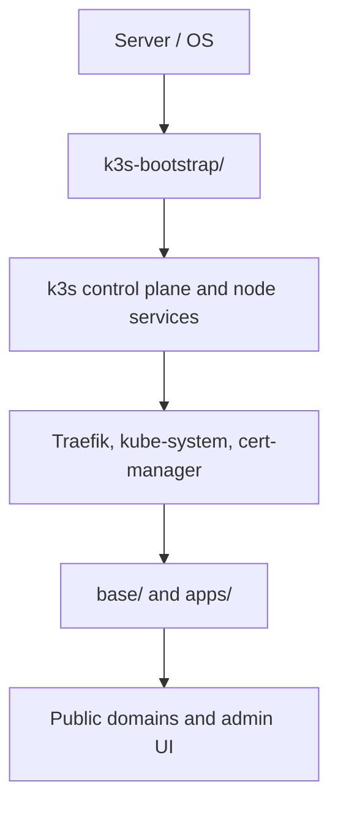
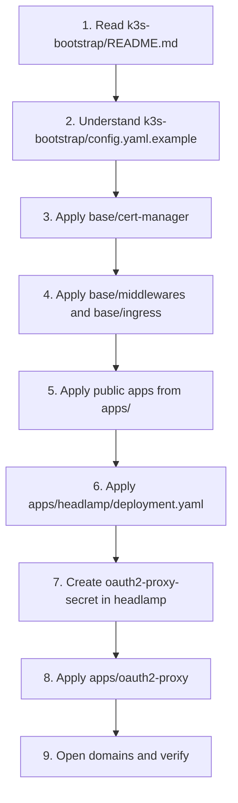
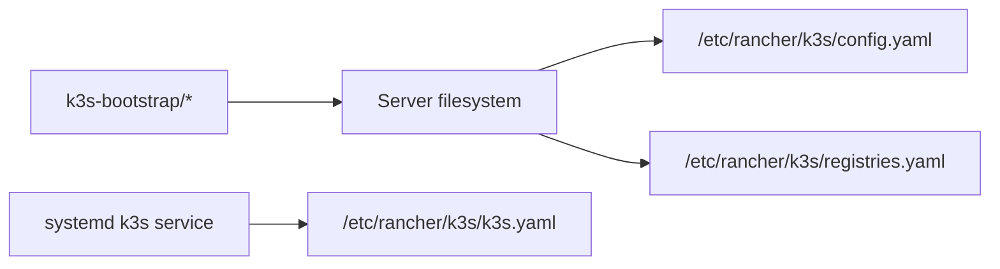
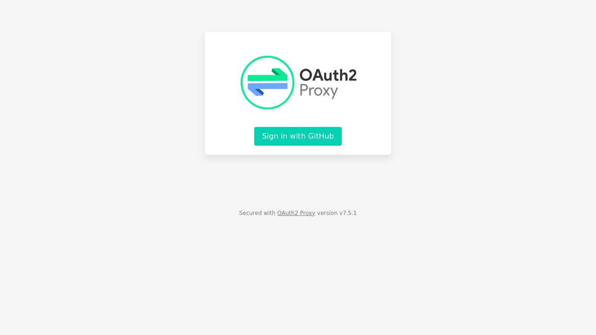
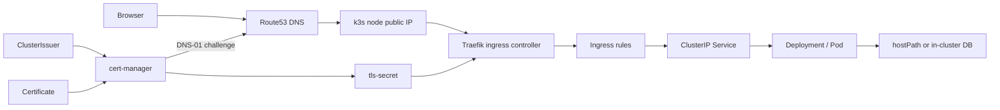
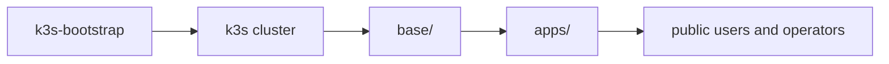
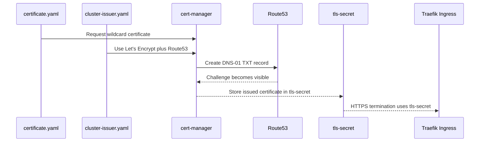
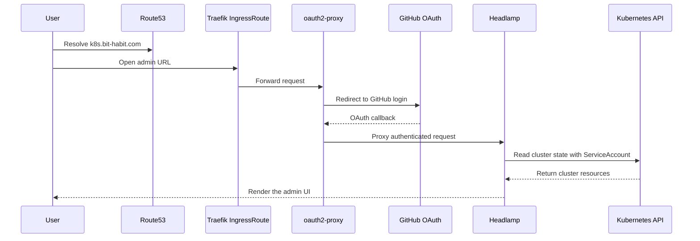

# bit-habit-infra

This repository now documents the full picture in **two layers**:

1. `k3s-bootstrap/`
   The server-side bootstrap layer for k3s itself
2. `base/` and `apps/`
   The cluster workload layer for ingress, certificates, apps, and admin UI

That split is the easiest way to understand how this cluster is actually managed.

## 1. Start Here: Two Layers, Two Responsibilities

If you are confused about "where k3s ends" and "where app manifests begin", this is the boundary:



Read it like this:

- `k3s-bootstrap/` is for how the cluster itself is installed and configured.
- `base/` and `apps/` are for what runs inside that cluster.
- This repo now keeps both ideas visible, but they are still different layers.

## 2. Beginner-First Reading and Deployment Order

If you only want the shortest path to understanding this repo, read and apply in this order:



Typical workload commands:

```bash
kubectl apply -f base/cert-manager/
kubectl apply -f base/middlewares/
kubectl apply -f base/ingress.yaml

kubectl apply -f apps/static-web/deployment.yaml
kubectl apply -f apps/startpage/deployment.yaml
kubectl apply -f apps/booktoss/deployment.yaml
kubectl apply -f apps/ghost/deployment.yaml
kubectl apply -f apps/wikijs/deployment.yaml

kubectl apply -f apps/headlamp/deployment.yaml

kubectl create secret generic oauth2-proxy-secret \
  -n headlamp \
  --from-literal=cookie-secret="YOUR_COOKIE_SECRET" \
  --from-literal=client-id="YOUR_GITHUB_CLIENT_ID" \
  --from-literal=client-secret="YOUR_GITHUB_CLIENT_SECRET" \
  --dry-run=client -o yaml | kubectl apply -f -

kubectl apply -f apps/oauth2-proxy/deployment.yaml
kubectl apply -f apps/oauth2-proxy/ingress.yaml
```

## 3. What `k3s-bootstrap/` Means

`k3s-bootstrap/` is the place for the part that was previously missing from this repo:

- how the k3s server is installed
- how `/etc/rancher/k3s/config.yaml` is managed
- how `/etc/rancher/k3s/registries.yaml` is managed
- how operators think about the generated kubeconfig at `/etc/rancher/k3s/k3s.yaml`

This directory is **not** auto-applied by Kubernetes. It is a documentation and template layer for the server itself.



## 4. Public Admin Entry Screen

This is the public landing screen currently shown at `https://k8s.bit-habit.com` before GitHub authentication. The screenshot was captured on **March 18, 2026 (UTC)**.



Operational meaning:

- the public URL is fronted by `oauth2-proxy`
- unauthenticated users see GitHub sign-in first
- `Headlamp` only appears after successful GitHub OAuth

## 5. The One-Sentence Model

This repo manages the cluster in two stages:

- `k3s-bootstrap/` explains how the k3s host is configured
- `base/` and `apps/` run `Route53 -> Traefik -> Ingress -> Service -> Pod` workloads inside that cluster

## 6. The Three-File Learning Path

Understanding this cluster comes down to three files, read in order:

```
1. config.yaml          ← How k3s itself was installed and configured (server layer)
2. base/ingress.yaml    ← How public traffic is routed to each service (network layer)
3. deployment.yaml      ← How each application actually runs inside the cluster (app layer)
```

If these three make sense, the rest of the repo is just detail.

Start here if you are new.

### 6.1 `config.yaml` — the k3s server configuration

There are **two related files** to know here.

#### A. The real file on the server: `/etc/rancher/k3s/config.yaml`

This file lives on the host machine, not inside the Kubernetes cluster.
k3s reads it once at startup, before any Pod or Ingress exists.

> **Current state:** this server was installed without a `config.yaml`.
> k3s is running with its built-in defaults.
> The file `/etc/rancher/k3s/config.yaml` does not exist on disk.
> k3s still works, but no custom options (TLS SAN, node labels, disabled components) are active.

If a `config.yaml` were present, it would look like this:

```yaml
# /etc/rancher/k3s/config.yaml
# Read by k3s at startup. Edit this file, then restart k3s to apply changes.
# sudo systemctl restart k3s

# Allow non-root users to read the generated kubeconfig at /etc/rancher/k3s/k3s.yaml
write-kubeconfig-mode: "0644"

# Disable built-in components you want to replace.
# servicelb is the default load balancer; disable it if you use MetalLB or similar.
disable:
  - servicelb

# Extra hostnames added to the API server TLS certificate.
# Required so kubectl (or Headlamp) can reach the API at a public domain name.
tls-san:
  - k8s.bit-habit.com

# Stable label attached to this node.
# Useful later for scheduling Pods to specific nodes, or for documentation.
node-label:
  - "bit-habit.com/role=main"
```

#### B. The repo template: [`k3s-bootstrap/config.yaml.example`](k3s-bootstrap/config.yaml.example)

This is a copy of what the real file should look like.
It lives in the repo so the intended configuration is documented and version-controlled,
even though k3s reads from `/etc/rancher/k3s/`, not from this repo.

To apply it to a real server:

```bash
sudo cp k3s-bootstrap/config.yaml.example /etc/rancher/k3s/config.yaml
# Edit as needed, then restart k3s
sudo systemctl restart k3s
```

#### Why this is the first file to read

`config.yaml` is the foundation. Everything else (Traefik, the cluster API, the kubeconfig) is
generated by k3s based on this configuration. If this layer is wrong or missing, the network
behaviour above it becomes hard to reason about.

### 6.2 [`base/ingress.yaml`](base/ingress.yaml)

This file can be read as a **general gateway** and a **special-purpose gateway**.
It breaks into three tiers.

---

#### Tier 1 — Resource (two Ingress objects)

The file contains two separate Ingress objects.

| Object              | Role                                                                                                                                                                |
| ------------------- | ------------------------------------------------------------------------------------------------------------------------------------------------------------------- |
| `main-ingress`      | Central control room. Handles every subdomain in the bit-habit.com ecosystem. Most traffic passes through here.                                                     |
| `habit-api-ingress` | Special-ops room. Exists only for the `/api/` path of `habit.bit-habit.com`. Isolated so a path-stripping middleware can be applied without affecting other routes. |

Why split them?
Traefik middleware annotations apply to the **entire Ingress object**, not to individual paths inside it.
If both `/` and `/api/` were in the same object, the strip-prefix middleware would fire on all routes, which breaks the frontend.
Splitting creates a clean boundary: one object with no middleware, one object with middleware.

---

#### Tier 2 — Component (three parts inside each Ingress)

Each Ingress object is made of three sections.

| Section                | What it does                                                                                                                                       |
| ---------------------- | -------------------------------------------------------------------------------------------------------------------------------------------------- |
| `metadata.annotations` | Post-it notes for Traefik. Declares which ingress class to use, which entrypoint to listen on (HTTPS only), and which cert-manager issuer to call. |
| `spec.tls`             | Declares which domains get HTTPS and which Kubernetes Secret stores the certificate.                                                               |
| `spec.rules`           | The actual routing table. Maps `host` + `path` to a backend Service.                                                                               |

---

#### Tier 3 — Routing (what goes where)

The routing rules inside `main-ingress` fall into three groups.

| Group               | Hosts                                                                                       | Backend                                                                                                                                           |
| ------------------- | ------------------------------------------------------------------------------------------- | ------------------------------------------------------------------------------------------------------------------------------------------------- |
| Static / Landing    | `bit-habit.com`, `www`, `status`, `habit` (root)                                            | `static-web-svc` — serves plain HTML                                                                                                              |
| Applications        | `blog`, `booktoss`, `code-server`, `viz`, `wiki`, `daily-seongsu`, `startpage`, `seoul-apt` | Each host maps to its own dedicated Service                                                                                                       |
| API (special logic) | `habit.bit-habit.com/api/`                                                                  | `bithabit-api-svc` — handled by `habit-api-ingress` with the `strip-api-prefix` middleware removing `/api` before the request reaches the backend |

Path priority note: `/api/` beats `/` when both could match the same request, because Traefik (and Kubernetes Ingress in general) always prefers the **longer, more specific path**. This is the same longest-prefix-match rule used in IP routing tables.

### 6.3 `deployment.yaml` — how an application actually runs

Every app in `apps/` has a `deployment.yaml`.
This is the third file type to understand, because it is where the actual container lives.

A typical `deployment.yaml` contains three Kubernetes objects bundled together:

```
Deployment   ← defines the container image, environment variables, volumes, and replicas
Service      ← gives the container a stable internal hostname other pods can call
Secret       ← (created separately, referenced here) stores passwords and API keys
```

Why the split? Each object has one job:

| Object       | Question it answers                                                 |
| ------------ | ------------------------------------------------------------------- |
| `Deployment` | What container runs? With what config? How many copies?             |
| `Service`    | What name does the rest of the cluster use to reach this container? |
| `Secret`     | Where are the credentials, kept separate from the code?             |

Example from `apps/ghost/deployment.yaml`:

```yaml
# Deployment — run the Ghost CMS container
apiVersion: apps/v1
kind: Deployment
metadata:
  name: ghost
spec:
  containers:
    - image: ghost:5-alpine # which container image
      env:
        - name: url
          value: https://blog.bit-habit.com # runtime config passed as env vars
        - name: database__connection__password
          valueFrom:
            secretKeyRef: # password is never written here directly
              name: ghost-mysql-pass # it is pulled from a Secret at runtime
              key: password
      volumeMounts:
        - mountPath: /var/lib/ghost/content # where data lives inside the container
  volumes:
    - hostPath:
        path: /home/ubuntu/workspace/ghost-data/content # backed by a host directory
---
# Service — stable internal address for Traefik to call
apiVersion: v1
kind: Service
metadata:
  name: ghost-svc
spec:
  ports:
    - port: 80 # what the cluster (and Ingress) uses
      targetPort: 2368 # what Ghost actually listens on inside the container
```

#### Why this is the third file to read

`config.yaml` starts the cluster.
`ingress.yaml` routes traffic to the right service name.
`deployment.yaml` is where that service name resolves to a real running container.

Reading all three in order shows the full path from public internet to application code.

## 7. Public Traffic Flow

Read public traffic before you read the admin UI.



Four things to remember:

1. `Route53` resolves domains and participates in DNS-01 validation.
2. `Traefik` is the public ingress controller.
3. `Ingress` maps hostnames and paths to `Service` objects.
4. `Service` sends traffic to the actual application Pods.

## 8. File Inventory by Layer

### 8.1 `k3s-bootstrap/`

| File                                      | Purpose                                           | Beginner note                               |
| ----------------------------------------- | ------------------------------------------------- | ------------------------------------------- |
| `k3s-bootstrap/README.md`                 | Explains what belongs to the k3s server layer     | Start here if you want the "whole picture"  |
| `k3s-bootstrap/config.yaml.example`       | Example k3s server config                         | Maps to `/etc/rancher/k3s/config.yaml`      |
| `k3s-bootstrap/registries.yaml.example`   | Example private registry / mirror config          | Maps to `/etc/rancher/k3s/registries.yaml`  |
| `k3s-bootstrap/install-server.sh.example` | Example installation command for the first server | Shows how bootstrap and config tie together |

### 8.2 `base/`

`base/` is the cluster front door: certificates, shared ingress, and shared Traefik middleware.

| File                                         | What it defines                                                        | Beginner note                                     |
| -------------------------------------------- | ---------------------------------------------------------------------- | ------------------------------------------------- |
| `base/cert-manager/cluster-issuer.yaml`      | Production `ClusterIssuer` using Let’s Encrypt and `Route53` DNS-01    | Defines how certificates are issued               |
| `base/cert-manager/aws-secret.yaml`          | `route53-credentials-secret`                                           | Gives cert-manager access to Route53              |
| `base/cert-manager/certificate.yaml`         | Wildcard certificate request for `bit-habit.com` and `*.bit-habit.com` | Produces `tls-secret`                             |
| `base/ingress.yaml`                          | Main public ingress plus `/api/` ingress for `habit.bit-habit.com`     | Most domain routing starts here                   |
| `base/middlewares/strip-api-middleware.yaml` | Traefik `Middleware` that strips `/api`                                | Makes API paths line up with backend expectations |

### 8.3 `apps/`

`apps/` holds the actual workloads, admin components, and operator helper files.

| File                                             | What it defines                                     | Beginner note                                                             |
| ------------------------------------------------ | --------------------------------------------------- | ------------------------------------------------------------------------- |
| `apps/static-web/deployment.yaml`                | `static-web` Deployment and Service                 | Serves `bit-habit.com`, `habit.bit-habit.com`, and `status.bit-habit.com` |
| `apps/startpage/deployment.yaml`                 | `startpage` Deployment and Service                  | Serves `startpage.bit-habit.com`                                          |
| `apps/booktoss/deployment.yaml`                  | `booktoss` Deployment and Service                   | Depends on `booktoss-env`                                                 |
| `apps/code-server/deployment.yaml`               | `code-server` Deployment and Service                | Browser-based development environment                                     |
| `apps/viz-platform/deployment.yaml`              | `viz-platform` Deployment and Service               | Source tree mounted from the node                                         |
| `apps/bithabit-api/deployment.yaml`              | `bithabit-api` Deployment and Service               | API running inside the cluster                                            |
| `apps/bithabit-api/service.yaml`                 | `bithabit-api-svc` Service and manual `Endpoints`   | Alternative API mode forwarding to `10.0.0.61:8002`                       |
| `apps/ghost/deployment.yaml`                     | `ghost-mysql` and `ghost` Deployments plus Services | Blog plus MySQL                                                           |
| `apps/wikijs/deployment.yaml`                    | `wikijs-db` and `wikijs` Deployments plus Services  | Wiki.js plus PostgreSQL                                                   |
| `apps/headlamp/README.md`                        | Headlamp notes                                      | Headlamp-specific operator guidance                                       |
| `apps/headlamp/deployment.yaml`                  | Headlamp namespace, RBAC, Deployment, and Service   | Admin UI runtime                                                          |
| `apps/oauth2-proxy/README.md`                    | oauth2-proxy notes                                  | GitHub OAuth setup and troubleshooting                                    |
| `apps/oauth2-proxy/deployment.yaml`              | oauth2-proxy Deployment and Service                 | Admin authentication layer                                                |
| `apps/oauth2-proxy/ingress.yaml`                 | Traefik `IngressRoute` for `k8s.bit-habit.com`      | Public admin entrypoint                                                   |
| `apps/oauth2-proxy/secret.example.yaml.disabled` | Example Secret template                             | Helper template only                                                      |
| `apps/oauth2-proxy/update-secret.sh`             | Secret rotation helper                              | Updates the GitHub OAuth Secret and restarts oauth2-proxy                 |

### 8.4 `assets/`

| File                                 | Purpose                                   | Beginner note                                     |
| ------------------------------------ | ----------------------------------------- | ------------------------------------------------- |
| `assets/k8s-bit-habit-com-login.png` | Public screenshot of the admin entry page | Shows what users see before GitHub authentication |

## 9. Where the Layers Meet

This is the most useful mental model in the whole repo:



`k3s-bootstrap/` prepares the cluster.  
`base/` opens the front door.  
`apps/` provides the workloads.

## 10. Current Domain Map

| Host                          | Path    | Target                                   | Source file                                                       |
| ----------------------------- | ------- | ---------------------------------------- | ----------------------------------------------------------------- |
| `bit-habit.com`               | `/`     | `static-web-svc`                         | `base/ingress.yaml`                                               |
| `www.bit-habit.com`           | `/`     | `static-web-svc`                         | `base/ingress.yaml`                                               |
| `blog.bit-habit.com`          | `/`     | `ghost-svc`                              | `base/ingress.yaml`                                               |
| `www.blog.bit-habit.com`      | `/`     | `ghost-svc`                              | `base/ingress.yaml`                                               |
| `booktoss.bit-habit.com`      | `/`     | `booktoss-svc`                           | `base/ingress.yaml`                                               |
| `code-server.bit-habit.com`   | `/`     | `code-server-svc`                        | `base/ingress.yaml`                                               |
| `daily-seongsu.bit-habit.com` | `/`     | `daily-seongsu-svc`                      | `base/ingress.yaml`                                               |
| `habit.bit-habit.com`         | `/`     | `static-web-svc`                         | `base/ingress.yaml`                                               |
| `habit.bit-habit.com`         | `/api/` | `bithabit-api-svc` plus `/api` stripping | `base/ingress.yaml`, `base/middlewares/strip-api-middleware.yaml` |
| `startpage.bit-habit.com`     | `/`     | `startpage-svc`                          | `base/ingress.yaml`                                               |
| `status.bit-habit.com`        | `/`     | `static-web-svc`                         | `base/ingress.yaml`                                               |
| `seoul-apt.bit-habit.com`     | `/`     | `seoul-apt-price`                        | `base/ingress.yaml`                                               |
| `viz.bit-habit.com`           | `/`     | `viz-platform-svc`                       | `base/ingress.yaml`                                               |
| `wiki.bit-habit.com`          | `/`     | `wikijs-svc`                             | `base/ingress.yaml`                                               |
| `www.wiki.bit-habit.com`      | `/`     | `wikijs-svc`                             | `base/ingress.yaml`                                               |
| `k8s.bit-habit.com`           | `/`     | `oauth2-proxy -> Headlamp`               | `apps/oauth2-proxy/ingress.yaml`                                  |

Two Services are referenced in ingress but do not currently have matching manifests in `apps/`:

- `daily-seongsu-svc`
- `seoul-apt-price`

That usually means they are managed elsewhere or are still missing from this repo.

## 11. How Route53 and cert-manager Issue TLS

This repo uses `AWS Route53`. cert-manager creates the DNS-01 challenge records in Route53, waits for validation, and then stores the certificate in `tls-secret`.



## 12. Admin UI Flow

`k8s.bit-habit.com` does not point directly to Headlamp. It first goes through `oauth2-proxy`, and only authenticated users reach Headlamp.



Key distinction:

- GitHub OAuth controls who can reach the UI.
- Kubernetes RBAC controls what that UI can do once inside.

## 13. Can Headlamp Provide a Shell or kubectl Access?

In practical terms:

- Headlamp can inspect resources, show logs, and open pod-level exec sessions.
- Headlamp is still not a full browser shell environment in this repo.
- This repo does not currently provide a general-purpose web terminal or raw `kubectl` shell from the browser.

If you want that later, the sensible options are:

- Headlamp Desktop with a local kubeconfig on an operator machine
- a separate web terminal behind `oauth2-proxy` with tight RBAC and audit controls

## 14. Future Work

This repo does not currently use `Terraform` or `Helm`, and that is intentional for now.

Possible future directions:

- `Terraform`
  - If OCI infrastructure needs to become reproducible in code later, a `terraform/` directory could manage resources such as:
  - the Ubuntu instance
  - VCN / subnet
  - NSG rules
  - public IP
  - DNS records
- `Helm`
  - If third-party Kubernetes packages grow later, `Helm` could be used for components such as:
  - `cert-manager`
  - `Argo CD`
  - `Prometheus` and `Grafana`
  - `external-dns`

For now, the repo stays intentionally simple:

- `k3s-bootstrap/` for host-side k3s setup
- `base/` for shared cluster entry resources
- `apps/` for workload manifests

## 15. Verification

General checks:

```bash
kubectl get ns
kubectl get pods -A
kubectl get ingress -A
kubectl get ingressroute -A
```

Headlamp and oauth2-proxy checks:

```bash
kubectl get pods -n headlamp
kubectl logs deploy/headlamp -n headlamp --tail=100
kubectl logs deploy/oauth2-proxy -n headlamp --tail=100
```

Server-side k3s checks:

```bash
sudo cat /etc/rancher/k3s/config.yaml
sudo cat /etc/rancher/k3s/registries.yaml
sudo cat /etc/rancher/k3s/k3s.yaml
sudo systemctl status k3s
```

## 16. Beginner Gotchas

### A `Service` is not the application itself

The real containers are in `Deployment -> Pod`. A `Service` is the stable network front for them.

### `Ingress` is only the front door

`Ingress` decides where traffic goes. It does not run the application code.

### `hostPath` couples workloads to one node

If you move a workload to another node without the same files and directories, it can break.

### `bithabit-api` has two different operating modes

- `apps/bithabit-api/deployment.yaml` runs the API inside the cluster.
- `apps/bithabit-api/service.yaml` forwards to an external IP `10.0.0.61:8002`.

They both touch `bithabit-api-svc`, so do not apply both casually.

### `k3s-bootstrap/` is not a Kubernetes apply directory

Those files describe the host-side k3s setup. They are templates and notes, not cluster manifests.

## 17. One-Line Memory Aid

The easiest way to understand this repo is:

`k3s-bootstrap/` creates the cluster, `base/` opens the front door, and `apps/` runs what users and operators actually touch.
