# bit-habit-infra

> A personal Kubernetes cluster running real apps — documented from zero to advanced.
>
> 💡 This document also works as a **Kubernetes beginner's guidebook**.
> Read as much as you want. Each section is self-contained.
> Stop whenever you feel satisfied — come back when you are ready for more.

---

### 👀 This is what you are looking at

This is a **live screenshot** of the cluster, taken from the Headlamp admin UI.
Every box is something actually running on this server right now.

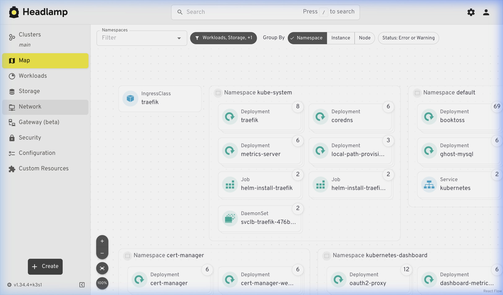

| Namespace              | What lives here                                                                |
| ---------------------- | ------------------------------------------------------------------------------ |
| `kube-system`          | k3s internals — `traefik` (traffic routing), `coredns` (DNS), `metrics-server` |
| `default`              | Public apps — `booktoss`, `ghost`, `wikijs`, `bithabit-api`, and more          |
| `cert-manager`         | Automatic HTTPS certificate issuer                                             |
| `kubernetes-dashboard` | `oauth2-proxy` — the GitHub login gate for the admin UI                        |
| `headlamp`             | Headlamp itself — the dashboard that produced this screenshot                  |
| `argocd`               | ArgoCD — GitOps controller that auto-syncs Git manifests to the cluster        |

**Want to understand what all of this means?** Start at section 1 and read as far as you like. ↓

## Table of Contents

- [1. ⚡ Understand in 10 seconds](#1--understand-in-10-seconds)
- [2. 📖 Understand in 1 minute](#2--understand-in-1-minute)
- [3. 📂 Understand in 10 minutes](#3--understand-in-10-minutes)
  - [3.1 File 1 — k3s-bootstrap/config.yaml.example](#31-file-1--k3s-bootstrapconfigyamlexample)
  - [3.2 File 2 — base/ingress.yaml](#32-file-2--baseingressyaml)
  - [3.3 File 3 — apps/\*/deployment.yaml](#33-file-3--appsdeploymentyaml)
- [4. 🔬 Understand in 100 minutes](#4--understand-in-100-minutes)
  - [4.1 How traffic moves — the full path](#41-how-traffic-moves--the-full-path)
    - [4.1.1 DNS — Route53](#411-dns--route53)
    - [4.1.2 TLS — what HTTPS actually means here](#412-tls--what-https-actually-means-here)
    - [4.1.3 Traefik — the ingress controller](#413-traefik--the-ingress-controller)
  - [4.2 Kubernetes core objects](#42-kubernetes-core-objects)
    - [4.2.1 Pod](#421-pod)
    - [4.2.2 ReplicaSet](#422-replicaset)
    - [4.2.3 Deployment](#423-deployment)
    - [4.2.4 Service](#424-service)
    - [4.2.5 Ingress](#425-ingress)
    - [4.2.6 Middleware — the /api/ case](#426-middleware--the-api-case)
  - [4.3 Networking internals](#43-networking-internals)
    - [4.3.1 How Services actually work — iptables and netfilter](#431-how-services-actually-work--iptables-and-netfilter)
    - [4.3.2 Load balancing in this cluster](#432-load-balancing-in-this-cluster)
    - [4.3.3 Ports — which port does what](#433-ports--which-port-does-what)
  - [4.4 Storage](#44-storage)
    - [4.4.1 hostPath volumes — the simple trade-off](#441-hostpath-volumes--the-simple-trade-off)
  - [4.5 Certificates — cert-manager and Let's Encrypt](#45-certificates--cert-manager-and-lets-encrypt)
    - [4.5.1 DNS-01 challenge — step by step](#451-dns-01-challenge--step-by-step)
  - [4.6 Authentication and authorization](#46-authentication-and-authorization)
    - [4.6.1 oauth2-proxy — who can open the browser tab](#461-oauth2-proxy--who-can-open-the-browser-tab)
    - [4.6.2 RBAC — what Headlamp can do once inside](#462-rbac--what-headlamp-can-do-once-inside)
  - [4.7 The cluster's data store — etcd](#47-the-clusters-data-store--etcd)
    - [4.7.1 What etcd stores](#471-what-etcd-stores)
    - [4.7.2 What happens if etcd is lost](#472-what-happens-if-etcd-is-lost)
  - [4.8 GitOps — what it means and why it matters](#48-gitops--what-it-means-and-why-it-matters)
    - [4.8.1 What GitOps is](#481-what-gitops-is)
    - [4.8.2 How this repo relates to GitOps](#482-how-this-repo-relates-to-gitops) ➡️ [Full ArgoCD Guide](docs/argocd-guide.md)
  - [4.9 The complete picture](#49-the-complete-picture)
- [5. 🧠 Understand in 1000 minutes](#5--understand-in-1000-minutes)
  - [5.1 Cluster and node questions](#51-cluster-and-node-questions)
  - [5.2 Networking questions](#52-networking-questions)
  - [5.3 TLS and certificates questions](#53-tls-and-certificates-questions)
  - [5.4 Security and RBAC questions](#54-security-and-rbac-questions)
  - [5.5 Observability questions](#55-observability-questions)
  - [5.6 CI/CD and GitOps questions](#56-cicd-and-gitops-questions)
  - [5.7 Scaling and reliability questions](#57-scaling-and-reliability-questions)
  - [5.8 The questions that will take the longest](#58-the-questions-that-will-take-the-longest)

---

## 1. ⚡ Understand in 10 seconds

```
Internet → your domain → this server → your app
```

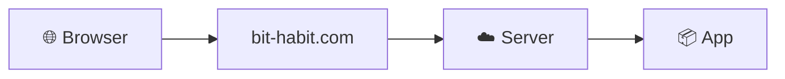

This repo is the instruction manual for **the server and everything running on it**.

---

## 2. 📖 Understand in 1 minute

This server runs **k3s** — a lightweight version of Kubernetes.

Think of Kubernetes like a **shipping port**:

| Real world          | This infra                     |
| ------------------- | ------------------------------ |
| The port itself     | k3s (the cluster)              |
| Cranes and roads    | Traefik (moves traffic in)     |
| Shipping containers | Docker containers (your apps)  |
| Cargo labels        | Ingress rules (who goes where) |
| Security gate       | oauth2-proxy (login required)  |

The repo has two layers:

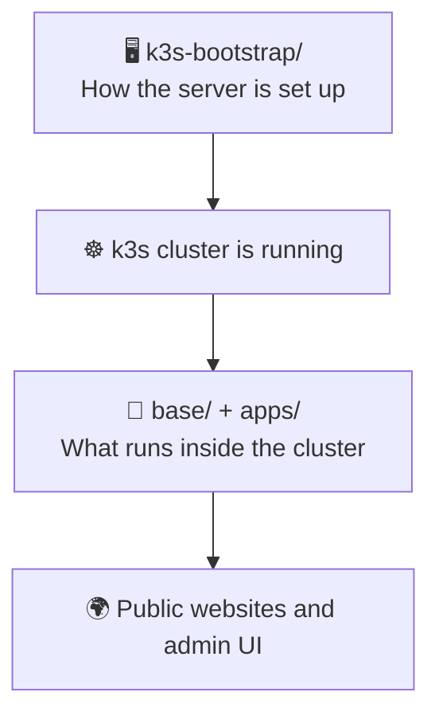

- **`k3s-bootstrap/`** — how k3s was installed on the machine. Templates and notes only. Not applied by Kubernetes.
- **`base/`** — the front door. Certificates, routing rules, shared middleware.
- **`apps/`** — the actual apps. Ghost blog, Wiki.js, Headlamp admin, and more.

---

## 3. 📂 Understand in 10 minutes

Everything in this cluster makes sense if you read **three files** in order.

### 3.1 File 1 — `k3s-bootstrap/config.yaml.example`

This is the k3s server config. It lives on the **host machine**, not inside Kubernetes. k3s reads it once at startup.

```yaml
# /etc/rancher/k3s/config.yaml
write-kubeconfig-mode: "0644" # let non-root users run kubectl
disable:
  - servicelb # turn off the built-in load balancer
tls-san:
  - k8s.bit-habit.com # add your domain to the API server TLS certificate
node-label:
  - "bit-habit.com/role=main" # tag this node for scheduling
```

> **Current state:** this file does not exist on disk. k3s is running on its built-in defaults, which works fine for a single-node setup.

#### Do you need this file?

| Situation                               | Need config.yaml?                     |
| --------------------------------------- | ------------------------------------- |
| Simple local cluster, kubectl with sudo | No                                    |
| Run kubectl without sudo                | Yes — `write-kubeconfig-mode: "0644"` |
| Access the API from a public domain     | Yes — add `tls-san`                   |
| Replace the built-in load balancer      | Yes — `disable: [servicelb]`          |

---

### 3.2 File 2 — `base/ingress.yaml`

This is the routing table. It tells Traefik which domain goes to which app.

```
bit-habit.com            → static-web-svc
blog.bit-habit.com       → ghost-svc
wiki.bit-habit.com       → wikijs-svc
habit.bit-habit.com/api/ → bithabit-api-svc  (with /api prefix stripped)
k8s.bit-habit.com        → oauth2-proxy → Headlamp
```

Why are there **two separate Ingress objects**?

Traefik middleware applies to the **whole Ingress object**, not to individual paths inside it. If `/` and `/api/` were in the same object, the strip-prefix middleware would fire on all routes. Splitting creates a clean boundary.

---

### 3.3 File 3 — `apps/*/deployment.yaml`

Every app has a `deployment.yaml`. It answers three questions:

```
Deployment  →  What container runs? What config does it get?
Service     →  What name does the cluster use to reach it?
Secret      →  Where are the passwords stored safely?
```

Example from Ghost:

```yaml
image: ghost:5-alpine
env:
  - name: url
    value: https://blog.bit-habit.com
  - name: database__connection__password
    valueFrom:
      secretKeyRef:
        name: ghost-mysql-pass # password is never written here directly
        key: password
---
apiVersion: v1
kind: Service
metadata:
  name: ghost-svc # ← Ingress calls this name
spec:
  ports:
    - port: 80
      targetPort: 2368
```

How all three files connect:

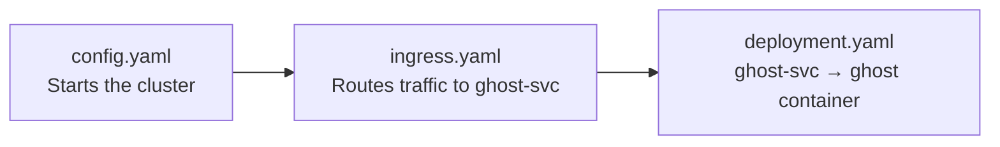

---

## 4. 🔬 Understand in 100 minutes

Now let's look at how traffic **actually moves** from a browser to your app — and every layer involved.

### 4.1 How traffic moves — the full path

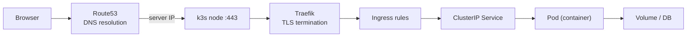

---

#### 4.1.1 🌐 DNS (Domain Name System) — Route53

**DNS** is the internet's phone book. Every human-readable domain name like `blog.bit-habit.com` is mapped to a numeric **IP address** (Internet Protocol address — the actual address computers use to find each other on the network, e.g. `123.45.67.89`).

When a user types `blog.bit-habit.com`, their browser asks DNS: _"what IP address is this domain pointing to?"_ Route53 (Amazon's managed DNS service) answers with this server's public IP.

Route53 also plays a second role: **DNS-01 challenge**. When cert-manager wants to prove it controls `*.bit-habit.com`, it temporarily writes a TXT record in Route53. Let's Encrypt checks for that record and then issues the certificate.

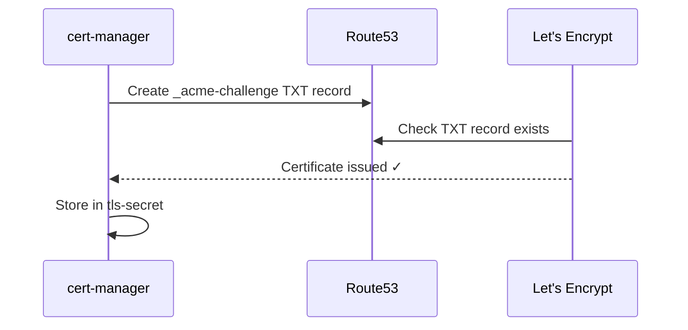

---

#### 4.1.2 🔒 TLS (Transport Layer Security) — what HTTPS actually means here

**TLS** (Transport Layer Security) is the encryption technology behind the `S` in **HTTPS** (HyperText Transfer Protocol Secure). Think of it like sealing a letter in an envelope — without TLS the network traffic is a postcard anyone can read; with TLS it is sealed so only the sender and recipient can open it.

> **HTTP** (HyperText Transfer Protocol) is the base language browsers and servers use to talk to each other. **HTTPS** = HTTP + TLS encryption on top.

How it works here:

- cert-manager 🤖 automatically requests a **wildcard certificate** (`*.bit-habit.com`) from Let's Encrypt
- The certificate is stored in a Kubernetes `Secret` called `tls-secret`
- Traefik reads `tls-secret` and handles TLS at the edge — this step is called **TLS termination** (Traefik unwraps the encryption here so Pods don't have to)
- Traffic **inside the cluster** (Traefik → Pod) travels over the internal network without TLS since it never leaves the server

```
Browser ──[HTTPS encrypted]──► Traefik ──[HTTP plain]──► Pod
                                ↑
                          tls-secret lives here
```

A **certificate** is like a verified ID card for your domain. 🪪 It proves to the browser that `blog.bit-habit.com` is really your server and not someone pretending to be you.

---

#### 4.1.3 🚦 Traefik — the ingress controller

Traefik is a **reverse proxy**. It sits in front of all apps and decides where each request goes.

A **proxy** is a middleman. A **reverse proxy** is a middleman on the _server side_ — the browser talks to Traefik, and Traefik talks to the real app. Think of it like a hotel receptionist who takes all guest requests and routes them to the right room.

Traefik listens on:

- `:80` — HTTP port, redirects everything to HTTPS automatically
- `:443` — HTTPS port, handles real traffic after TLS termination

When you `kubectl apply` a new Ingress, Traefik picks it up automatically without restarting. This is because it watches the Kubernetes **API** (Application Programming Interface — the communication channel through which all parts of the cluster exchange information and instructions) for changes in real time.

---

### 4.2 ☸️ Kubernetes core objects

#### 4.2.1 📦 Pod

A Pod is the smallest unit in Kubernetes. It is one (or a few) running containers.

```
Pod: ghost
  └── container: ghost:5-alpine
        port: 2368
        env: url=https://blog.bit-habit.com
        volume: /var/lib/ghost/content
```

Pods are **temporary**. If a Pod crashes, Kubernetes starts a new one — but it gets a different internal IP address. This is why you should never connect to a Pod's IP directly.

---

#### 4.2.2 🔄 ReplicaSet

A ReplicaSet makes sure a given number of identical Pods are always running.

```
ReplicaSet: ghost (replicas: 1)
  └── Pod: ghost-7d9f-xk2p  ✓ running
```

If the Pod crashes, the ReplicaSet creates a new one immediately. You rarely create ReplicaSets directly — Deployments manage them for you.

---

#### 4.2.3 🚀 Deployment

A Deployment manages a ReplicaSet and adds **rolling updates**.

When you update the container image, the Deployment creates a new ReplicaSet, gradually moves traffic to the new Pods, then removes the old ones. This means **zero downtime** during updates.

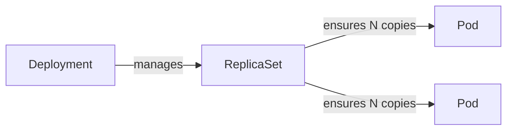

Think of it like this:

| Object     | Job                                                       |
| ---------- | --------------------------------------------------------- |
| Deployment | "I want ghost running, always at version X, with 1 copy"  |
| ReplicaSet | "OK, I will make sure exactly 1 Pod is running right now" |
| Pod        | Actually running the container                            |

---

#### 4.2.4 🔌 Service

A Service gives a **stable internal name and IP** to a set of Pods.

Since Pod IPs change every time a Pod restarts, a Service acts as the permanent address that everything else can rely on.

```
Service: ghost-svc
  clusterIP: 10.43.x.x       ← stable, never changes
  selector: app=ghost         ← finds matching Pods automatically
  port: 80 → targetPort: 2368
```

Inside the cluster, anything can reach Ghost by calling `ghost-svc:80`. The Service proxies the request to the actual Pod on port `2368`.

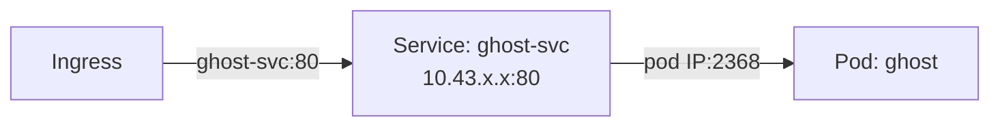

---

#### 4.2.5 🚪 Ingress

An Ingress is a set of routing rules for **external HTTP/HTTPS traffic**.

It does not run anything. It just says: _"if the hostname is X and the path is Y, send to Service Z."_ Traefik reads these rules and acts on them.

```yaml
rules:
  - host: blog.bit-habit.com
    http:
      paths:
        - path: /
          backend:
            service:
              name: ghost-svc
              port: 80
```

---

#### 4.2.6 ⚙️ Middleware — the `/api/` case

`habit.bit-habit.com/api/` needs special handling. The backend API expects requests at `/`, not `/api/`.

A **middleware** is a step that transforms the request before it reaches the app.

```
Browser sends:   GET habit.bit-habit.com/api/users
Middleware runs: strip "/api"
Backend receives: GET /users   ✓
```

This middleware is attached to a **separate Ingress object** (`habit-api-ingress`) so it does not affect other routes on the same host.

---

### 4.3 🕸️ Networking internals

#### 4.3.1 🔧 How Services actually work — iptables and netfilter

When a request hits `ghost-svc:80`, something in the Linux kernel needs to redirect it to the actual Pod IP. This is done by **iptables** and **netfilter**.

**netfilter** is a framework built into the Linux kernel that can inspect and modify network packets as they move through the system. Think of it as a set of hooks in the kernel where you can run code on every packet.

**iptables** is a tool that writes rules to netfilter. It says things like: _"any packet going to 10.43.x.x:80 — rewrite the destination to 10.42.0.5:2368"_.

In standard Kubernetes, `kube-proxy` writes these iptables rules for every Service. In k3s, `kube-proxy` is replaced by a lightweight alternative that does the same job.

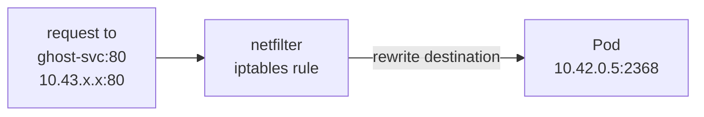

You do not need to manage iptables manually. Kubernetes handles this every time you create or delete a Service.

---

#### 4.3.2 ⚖️ Load balancing in this cluster

In this cluster, most apps run with **1 replica**, so there is no load balancing across multiple Pods.

If you scaled to more replicas, the Service would distribute requests across all matching Pods using **round-robin** — Pod 1 gets request 1, Pod 2 gets request 2, and so on.

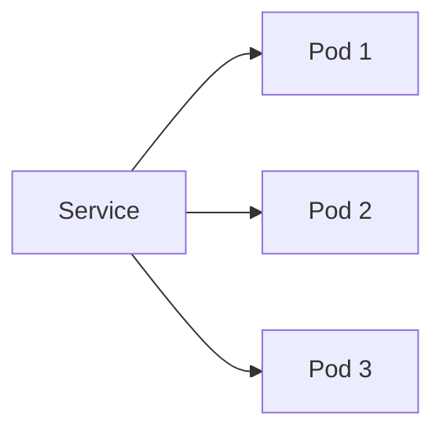

k3s includes a built-in load balancer called `servicelb`. It is disabled in `config.yaml` here because Traefik handles external traffic instead.

---

#### 4.3.3 🔢 Ports — which port does what

It is easy to get confused by all the port numbers. Here is the map:

```
Internet     :443   → Traefik (HTTPS entry point)
Internet     :80    → Traefik (redirects to :443)
Traefik      :80    → ghost-svc (inside cluster, via Service)
ghost-svc    :80    → Pod :2368 (targetPort in Service)
Ghost app    :2368  ← what Ghost actually listens on
```

Each layer uses its own port. The Service translates between them.

---

### 4.4 💾 Storage

#### 4.4.1 📁 hostPath volumes — the simple trade-off

Most apps here store data in a `hostPath` volume — a directory on the host machine mounted directly into the container.

```
Pod: ghost
  volume hostPath → /home/ubuntu/workspace/ghost-data/content  (on the host)
                  → /var/lib/ghost/content                      (inside the container)
```

**Advantage:** simple. No extra storage driver or network storage needed.

**Trade-off:** the data is tied to this specific host machine. If the Pod moves to a different node, the data stays on the old node and the app breaks.

For a **single-node cluster** like this one, hostPath is perfectly fine. For multi-node clusters, you would use a `PersistentVolumeClaim` with a network storage driver (like NFS or a cloud storage service) so data can follow the Pod anywhere.

---

### 4.5 📜 Certificates — cert-manager and Let's Encrypt

cert-manager is a Kubernetes add-on that **automatically manages TLS certificates**. Without it, you would have to manually request, renew, and deploy certificates yourself — a tedious and error-prone task.

**Let's Encrypt** is a free, non-profit certificate authority (CA). A CA is a trusted organisation that digitally signs your certificate, so browsers know it is genuine. Let's Encrypt issues certificates to anyone who can **prove they control the domain**.

There are two ways to prove domain ownership:

- **HTTP-01** — Let's Encrypt checks a specific **URL** (Uniform Resource Locator — a full web address including the path, e.g. `https://bit-habit.com/.well-known/acme-challenge/...`) on your server
- **DNS-01** — Let's Encrypt checks a TXT record in your DNS zone (used here, because only DNS-01 supports wildcard certificates like `*.bit-habit.com`)

---

#### 4.5.1 🔐 DNS-01 challenge — step by step

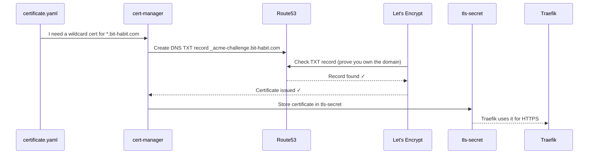

Certificates expire every 90 days. cert-manager renews them automatically before expiry.

---

### 4.6 🔐 Authentication and Authorization

These two words are often confused. They mean different things:

- 🪪 **Authentication (AuthN)** — _Who are you?_ Prove your identity. (e.g. show your passport)
- 🛡️ **Authorization (AuthZ)** — _What can you do?_ After I know who you are, what are you allowed to touch? (e.g. this passport lets you into Economy class only)

This cluster uses both for the admin UI.

---

#### 4.6.1 🔑 oauth2-proxy — who can open the browser tab

`k8s.bit-habit.com` (the Headlamp admin UI) must not be open to the public.

oauth2-proxy sits in front of Headlamp and forces every user to log in with **GitHub OAuth** first. If GitHub says you are allowed, oauth2-proxy passes the request through. Otherwise, you are blocked.

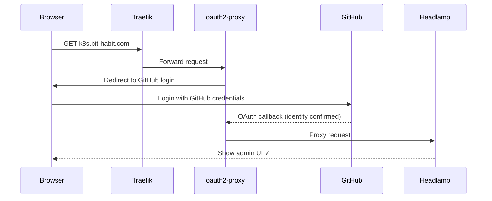

**OAuth** (Open Authorization) is an open standard protocol that lets a third-party service (GitHub) confirm your identity without you sharing your password with the site you are logging into. It is the same system used by "Login with Google" or "Login with Apple" buttons everywhere on the web. 🔗

---

#### 4.6.2 🛡️ RBAC (Role-Based Access Control) — what Headlamp can do once inside

**RBAC** stands for **Role-Based Access Control**. It is Kubernetes's system for controlling what each user or service is allowed to do inside the cluster.

After GitHub OAuth lets you into the browser, Headlamp talks to the Kubernetes API using a **ServiceAccount**. RBAC controls what that ServiceAccount is allowed to read, write, or delete.

The main RBAC objects:

| Object               | What it does                                                                  |
| -------------------- | ----------------------------------------------------------------------------- |
| `ServiceAccount`     | An identity for a Pod or app (like a user account, but for services)          |
| `Role`               | A list of allowed actions in one namespace (e.g. "can read Pods in headlamp") |
| `ClusterRole`        | Same, but across all namespaces                                               |
| `RoleBinding`        | Connects a Role to a ServiceAccount                                           |
| `ClusterRoleBinding` | Connects a ClusterRole to a ServiceAccount                                    |

Example mental model:

```
ServiceAccount: headlamp
  bound to ClusterRole: headlamp-reader
    allowed: get, list, watch → pods, deployments, services, ingresses
    not allowed: delete, create → anything
```

**GitHub OAuth** = controls who can reach the browser tab
**RBAC** = controls what Headlamp can do inside Kubernetes once you are in

---

### 4.7 🗄️ The cluster's data store — etcd

#### 4.7.1 📋 What etcd stores

**etcd** is the database of Kubernetes. It stores the **entire desired state of the cluster** as key-value pairs.

Every time you run `kubectl apply -f deployment.yaml`, your manifest is stored in etcd. The Kubernetes control plane reads from etcd to know what should be running, and writes to etcd whenever the state changes.

What lives in etcd:

- All Deployment, Service, Ingress, Pod, Secret definitions
- Cluster configuration
- RBAC rules
- Current status of every resource

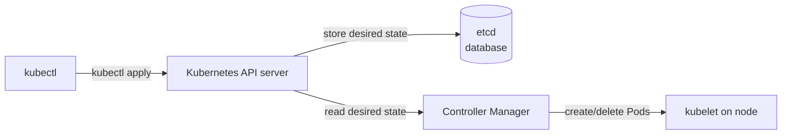

k3s uses **SQLite** by default instead of a full etcd cluster, to keep things lightweight on a single node. The behavior is the same from the user's perspective.

---

#### 4.7.2 ⚠️ What happens if etcd is lost

If etcd (or the SQLite file in k3s) is deleted or corrupted:

- The **cluster control plane stops working** — you cannot create, update, or delete resources
- **Running Pods keep running** — the kubelet on the node continues running whatever containers it already started
- But if any Pod crashes, it will not be restarted — nobody is managing it anymore
- You cannot recover the cluster without restoring etcd from a backup

This is why etcd backup is critical in production. On this single-node k3s setup, the data is at `/var/lib/rancher/k3s/server/db/`.

---

### 4.8 🔀 GitOps — what it means and why it matters

#### 4.8.1 💡 What GitOps is

**GitOps** is a way of managing infrastructure where **Git is the single source of truth**.

Instead of running `kubectl apply` by hand, you commit your manifests to a Git repo. A tool (like **Argo CD** or **Flux**) watches the repo and automatically applies any changes to the cluster.

> **CI/CD** stands for **Continuous Integration / Continuous Delivery** — the practice of automatically building, testing, and deploying code every time you push a change. GitOps is the infrastructure equivalent of CI/CD.

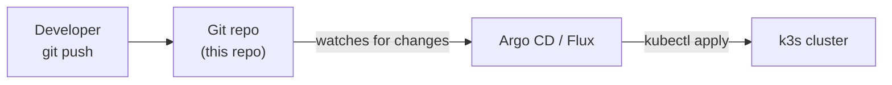

Benefits:

- Every change is tracked in Git history — you know who changed what and when
- Rolling back is `git revert` + push
- The cluster state always matches what is in the repo
- No manual `kubectl` commands that nobody wrote down

---

#### 4.8.2 🗺️ How this repo relates to GitOps

This repo **uses ArgoCD** for GitOps. ArgoCD watches the `main` branch and automatically syncs changes to the cluster.

Two ArgoCD Applications manage this repo:

| Application | Watches | What it manages |
|-------------|---------|-----------------|
| `bit-habit-base` | `base/` | Ingress, cert-manager, middlewares |
| `bit-habit-apps` | `apps/` | All application deployments and services |


The ArgoCD Web UI is available at `https://argocd.bit-habit.com`.

> 📖 **New to ArgoCD?** Read the full beginner's guide: **[ArgoCD Guide — From Zero to GitOps](docs/argocd-guide.md)**
>
> It covers installation, architecture, daily operations, CLI usage, troubleshooting, and more — with visual diagrams for every concept.

---

### 4.9 🖼️ The complete picture

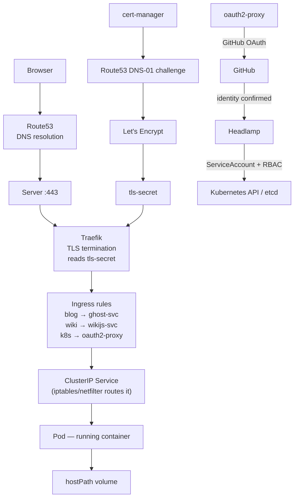

#### 🗺️ Live cluster map — what it looks like in Headlamp

This is the actual cluster state visualised by **Headlamp** (`k8s.bit-habit.com`), grouped by Namespace.


| Namespace              | What lives here                                                                                                    |
| ---------------------- | ------------------------------------------------------------------------------------------------------------------ |
| `kube-system`          | k3s system components — `traefik` (ingress), `coredns` (DNS), `metrics-server`, `local-path-provisioner` (storage) |
| `default`              | Most public apps — `booktoss`, `ghost-mysql`, `ghost`, `wikijs`, `bithabit-api`, `static-web`, etc.                |
| `cert-manager`         | `cert-manager` and its webhook — responsible for issuing and renewing TLS certificates                             |
| `kubernetes-dashboard` | `oauth2-proxy` (GitHub login gate) and `dashboard-metrics-scraper`                                                 |
| `headlamp`             | `headlamp` itself — the admin UI you are looking at                                                                |

---
## 5. 🧠 Understand in 1000 minutes

You understand the core concepts. These questions are worth sitting with — organized by topic. Each section includes a short _context_ note so you know what you already know before you ask.

> 💡 Each question has a short answer. But the real understanding comes from digging deeper yourself — so every answer ends with **→ search:** to point you in the right direction.

---

### 5.1 🖥️ Cluster and node questions

> _You know: k3s runs on one Ubuntu server. etcd (SQLite) stores cluster state. Pods keep running if etcd is lost, but will not restart._

---

**What happens to all running Pods if the single node shuts down? How does a multi-node setup change the answer?**

All Pods stop immediately — there is no other machine to keep them running. With multiple nodes, the control plane reschedules Pods from the failed node onto healthy ones.

→ search: `kubernetes node failure pod rescheduling`

---

**What does `systemctl restart k3s` actually do to running workloads?**

k3s restarts as a process, which briefly interrupts the control plane. Running containers managed by the kubelet may pause or restart depending on the runtime, but most come back quickly.

→ search: `k3s restart impact on pods`

---

**What is the difference between a k3s server node and an agent node?**

A server node runs the control plane (API server, scheduler, etcd). An agent node only runs the kubelet and container runtime — it runs workloads but makes no cluster decisions.

→ search: `k3s server vs agent node`

---

**If this cluster grew to 3 nodes, which apps would break due to `hostPath` volumes, and how would you migrate them?**

Any app whose data lives in a host directory (Ghost, Wiki.js, MySQL) would lose access to that data if its Pod moved to a different node. You would migrate by replacing hostPath with a PersistentVolumeClaim backed by shared network storage.

→ search: `kubernetes hostPath vs PersistentVolume migration`

---

**What is a `PersistentVolumeClaim`, and how does it differ from `hostPath`?**

A PersistentVolumeClaim (PVC) is a request for storage that Kubernetes fulfills from a storage pool — not tied to any one node. hostPath directly mounts a folder from the machine the Pod happens to land on.

→ search: `kubernetes PersistentVolumeClaim explained`

---

### 5.2 🕸️ Networking questions

> _You know: Services get a stable clusterIP. netfilter/iptables rewrites packet destinations. k3s replaces kube-proxy._

---

**When a Pod calls `ghost-svc:80`, how does DNS inside the cluster resolve `ghost-svc` to `10.43.x.x`? What is CoreDNS?**

Every Pod is configured to use CoreDNS as its DNS server. CoreDNS watches for Service objects in Kubernetes and automatically creates DNS records for them — so `ghost-svc` resolves to its clusterIP.

→ search: `kubernetes CoreDNS service discovery`

---

**What is the difference between `ClusterIP`, `NodePort`, and `LoadBalancer` Service types? When would you use each?**

ClusterIP is only reachable inside the cluster. NodePort opens a port on every node so external traffic can enter. LoadBalancer provisions an external IP (from a cloud provider or servicelb) for clean public access.

→ search: `kubernetes service types ClusterIP NodePort LoadBalancer`

---

**Traefik uses `IngressRoute` (a custom CRD) for `k8s.bit-habit.com` but standard `Ingress` for other apps. What is a CRD, and why would you use one instead of standard Ingress?**

A CRD (Custom Resource Definition) lets you add new object types to Kubernetes. Traefik's `IngressRoute` CRD offers features that standard Ingress does not support — like middleware chains and TCP routing — at the cost of being Traefik-specific.

→ search: `kubernetes CRD custom resource definition traefik IngressRoute`

---

**When a browser connects to `blog.bit-habit.com`, what is the exact sequence of IP addresses the packet travels through?**

Browser → Route53 returns server public IP → server NIC → Traefik process → iptables rewrites destination to Pod clusterIP → Pod IP inside the cluster network. Each hop is on a different address space.

→ search: `kubernetes packet flow from ingress to pod`

---

**What is a CNI plugin (Container Network Interface)? Which one does k3s use by default, and what does it do?**

A CNI plugin sets up the network between Pods — it assigns IP addresses to Pods and routes traffic between them. k3s uses **Flannel** by default, which creates a flat overlay network so every Pod can reach every other Pod regardless of which node it is on.

→ search: `kubernetes CNI plugin flannel explained`

---

### 5.3 🔒 TLS and certificates questions

> _You know: cert-manager does DNS-01 via Route53. Wildcard certificate stored in tls-secret. Traefik terminates TLS. Certs expire every 90 days and auto-renew._

---

**What is the difference between a wildcard certificate and individual per-domain certificates? What are the security trade-offs?**

A wildcard cert (`*.bit-habit.com`) covers all subdomains with one certificate — simpler to manage. Individual certs limit exposure: if a wildcard's private key leaks, all subdomains are compromised at once.

→ search: `wildcard certificate vs individual certificate security`

---

**What IAM permissions does `route53-credentials-secret` need? What is the principle of least privilege?**

cert-manager only needs `route53:ChangeResourceRecordSets` and `route53:GetChange` on the specific hosted zone — nothing else. Least privilege means granting only the exact permissions needed and nothing more, so a leaked key does minimal damage.

→ search: `cert-manager route53 IAM policy least privilege`

---

**What would happen if cert-manager failed to renew the certificate silently? How would you detect this before users see an error?**

After 90 days the certificate expires and browsers show a security warning — users cannot reach the site. You would detect this by monitoring the certificate expiry date in Prometheus or setting up an alert on the cert-manager `Certificate` object's `status.notAfter` field.

→ search: `cert-manager certificate expiry monitoring prometheus`

---

**What is end-to-end TLS (encryption from Traefik all the way to the Pod)? Is it worth implementing here?**

End-to-end TLS means traffic is also encrypted on the internal cluster network between Traefik and the Pod. For a single-node cluster where all traffic stays on `localhost`, it adds complexity with minimal security benefit — it matters more in multi-node or multi-tenant environments.

→ search: `traefik end-to-end TLS backend HTTPS`

---

**What is mutual TLS (mTLS), and in what scenarios would you need it?**

Standard TLS only proves the *server's* identity to the client. mTLS means both sides present certificates — the server also verifies the client. It is used in service meshes (like Istio or Linkerd) to ensure that only trusted services can talk to each other inside the cluster.

→ search: `mutual TLS mTLS kubernetes service mesh`

---

### 5.4 🛡️ Security and RBAC questions

> _You know: oauth2-proxy handles authentication via GitHub OAuth. RBAC controls what the Headlamp ServiceAccount can do. Authentication = who are you, Authorization = what can you do._

---

**What is the difference between a `Role` and a `ClusterRole`? When would you use one over the other?**

A `Role` applies only inside one namespace — use it to grant access to a specific app's resources. A `ClusterRole` applies across all namespaces — use it for admin tools like Headlamp that need to see the whole cluster.

→ search: `kubernetes Role vs ClusterRole RBAC`

---

**How would you audit what the Headlamp ServiceAccount is currently allowed to do?**

Run `kubectl auth can-i --list --as=system:serviceaccount:headlamp:headlamp -n headlamp` to see what actions are allowed. This prints every permitted verb/resource combination for that identity.

→ search: `kubectl auth can-i list serviceaccount permissions`

---

**Kubernetes Secrets are stored base64-encoded in etcd — not encrypted by default. What is encryption at rest?**

Base64 is encoding, not encryption — anyone who can read etcd can decode it instantly. Encryption at rest means the data on disk is encrypted with a key, so even if someone copies the etcd file, they cannot read the secrets without the key.

→ search: `kubernetes etcd encryption at rest secret`

---

**What are the risks of storing Kubernetes Secret manifests in a Git repo? What tools solve this?**

Anyone with repo access can base64-decode the secret and read the real value. Tools like **Sealed Secrets** encrypt the secret so only the cluster can decrypt it, making the Git-stored value useless outside the cluster.

→ search: `sealed secrets kubernetes SOPS external secrets operator`

---

**`code-server.bit-habit.com` exposes browser-based VS Code. What are the security implications?**

It gives anyone who can log in full shell access to the server — they can read files, run commands, and access all cluster credentials. At minimum it needs authentication (oauth2-proxy), strict RBAC on what the container can do, and ideally network policies limiting its outbound access.

→ search: `code-server security kubernetes network policy`

---

### 5.5 📊 Observability questions

> _You know: you can check logs with `kubectl logs` and Pod status with `kubectl get pods -A`._

---

**Logs disappear when a Pod restarts. How would you set up persistent log aggregation?**

You run a log collector (like Promtail or Fluentd) as a DaemonSet on every node. It tails container logs and ships them to a central store (Loki or Elasticsearch) where you can search them even after the Pod is gone.

→ search: `kubernetes log aggregation Loki Promtail DaemonSet`

---

**How would you know if `ghost-svc` is responding slowly?**

You would scrape metrics from Traefik (it exposes request duration histograms) and send them to Prometheus. A Grafana dashboard then shows you response times per route — and you set an alert if p99 latency exceeds a threshold.

→ search: `traefik prometheus metrics grafana dashboard`

---

**What is a liveness probe and a readiness probe? What goes wrong without them?**

A liveness probe tells Kubernetes whether the container is still alive — if it fails, the container is restarted. A readiness probe tells Kubernetes whether the container is ready to receive traffic — if it fails, the Pod is removed from the Service until it recovers. Without them, Kubernetes sends traffic to a container that may be broken but not yet crashed.

→ search: `kubernetes liveness readiness probe difference`

---

**What is the difference between metrics, logs, and traces?**

Metrics are numbers over time (CPU %, request count). Logs are text events (error messages, access logs). Traces follow a single request across multiple services showing where time was spent. Together they are called the "three pillars of observability."

→ search: `three pillars of observability metrics logs traces`

---

**How would you set up alerting so you are notified before users notice a problem?**

Prometheus evaluates alert rules (e.g. "cert expires in less than 7 days" or "Pod restart count > 3"). When a rule fires, Alertmanager routes the alert to Slack, PagerDuty, or email.

→ search: `prometheus alertmanager alerting rules kubernetes`

---

### 5.6 🔀 CI/CD and GitOps questions

> _You know: GitOps means Git is the source of truth. ArgoCD watches this repo and auto-applies changes to the cluster. See the [full ArgoCD guide](docs/argocd-guide.md) for hands-on instructions._

---

**What does `kubectl rollout undo deployment/ghost` do? How does Kubernetes know what to roll back to?**

It switches the Deployment back to the previous ReplicaSet. Kubernetes keeps a configurable history of ReplicaSets (default: 10), each one representing a past state of the Deployment spec.

→ search: `kubectl rollout undo deployment revision history`

---

**What is the difference between Recreate and RollingUpdate deployment strategies?**

Recreate kills all old Pods first, then starts new ones — there is a brief downtime window. RollingUpdate replaces Pods one at a time so the app stays available. Stateless apps like the static web server tolerate Recreate; Ghost with a database needs RollingUpdate to avoid connection drops.

→ search: `kubernetes deployment strategy Recreate RollingUpdate`

---

**If you added Argo CD to this cluster, how would it know which manifests to watch?**

You create an Argo CD `Application` resource that points to a Git repo URL and a path (e.g. `apps/ghost/`). Argo CD polls or webhooks the repo and applies any changes it finds, comparing the live cluster state to what is in Git.

→ search: `argocd Application resource git repo sync`

---

**What is a CI/CD pipeline? How would you auto-deploy on push?**

CI (Continuous Integration) runs tests and builds a new container image on every push. CD (Continuous Delivery/Deployment) takes that image and deploys it. A common setup: GitHub Actions builds and pushes the image to a registry, then updates the image tag in the manifest, and Argo CD picks up the change.

→ search: `github actions build push container image argocd deploy`

---

**What is image tagging? Why is `ghost:latest` bad in production?**

An image tag is a label pointing to a specific version of a container image. `latest` always points to the newest build — so a future `kubectl rollout restart` might pull a different version than what you tested, silently breaking your app. Use explicit version tags like `ghost:5.87.1` instead.

→ search: `docker image tag latest anti-pattern production`

---

### 5.7 📈 Scaling and reliability questions

> _You know: most apps run 1 replica. Services do round-robin load balancing across replicas. hostPath ties workloads to one node._

---

**None of the apps define resource requests or limits. What happens if Ghost consumes all available memory?**

The Linux kernel's OOM (Out Of Memory) killer picks a process to terminate — likely the container consuming the most memory, but not necessarily Ghost. Other apps on the node could be killed instead. Setting memory limits gives Kubernetes control over which Pod gets evicted first.

→ search: `kubernetes resource requests limits OOM killer`

---

**What is a PodDisruptionBudget, and why does it matter on a single-node cluster?**

A PodDisruptionBudget (PDB) tells Kubernetes "never take down more than N replicas of this app at once." Even on one node, it prevents `kubectl drain` (used for maintenance) from evicting a Pod that has no replacement ready yet.

→ search: `kubernetes PodDisruptionBudget node drain`

---

**What is a Horizontal Pod Autoscaler? What metrics would trigger it for Ghost?**

HPA watches a metric (usually CPU or memory usage) and automatically increases or decreases the replica count to match demand. For Ghost you might scale up when average CPU across Pods exceeds 70% — indicating the app is under load.

→ search: `kubernetes HorizontalPodAutoscaler CPU memory scaling`

---

**What does node pressure mean? What happens when resources are exhausted?**

Node pressure is a condition where disk, memory, or PID resources are running low. Kubernetes starts **evicting** Pods — terminating the least-prioritized ones to free up room. If pressure is not relieved, the node becomes `NotReady` and the control plane stops scheduling new Pods there.

→ search: `kubernetes node pressure eviction memory disk`

---

**How would you design this cluster to be rebuilt from scratch in under 30 minutes?**

You need: infrastructure-as-code for the server itself (Terraform), an automated k3s install script, all manifests in Git (this repo already does this), and a data backup/restore strategy for hostPath volumes. The goal is zero manual steps — just run one script.

→ search: `kubernetes disaster recovery infrastructure as code terraform k3s`

---

### 5.8 🏔️ The questions that will take the longest

These do not have quick answers. Write them down. Come back in a few months.

---

**How does the Linux kernel's netfilter actually redirect a packet at the system call level?**

When a Service is created, kube-proxy (or its k3s equivalent) writes iptables rules in the `nat` table's `PREROUTING` chain. Any packet whose destination matches the clusterIP is DNAT-rewritten to a real Pod IP before it even reaches a process.

→ search: `iptables DNAT PREROUTING kubernetes service deep dive`

---

**What exactly happens inside etcd when you run `kubectl apply`?**

kubectl serializes your manifest and sends it to the API server via HTTP. The API server validates it, runs admission controllers, writes the desired state to etcd, and returns. A controller manager watches etcd for changes and reconciles — creating a ReplicaSet, which triggers the scheduler to assign a Pod to a node, which the kubelet on that node turns into a running container.

→ search: `kubernetes kubectl apply flow API server etcd controller scheduler kubelet`

---

**How does container isolation actually work at the Linux level?**

Each container gets its own set of Linux **namespaces** (isolating process IDs, network, filesystem, users) and **cgroups** (limiting CPU and memory). **seccomp** filters which system calls the container is allowed to make. Together they create the illusion of a separate machine using only kernel features — no hypervisor needed.

→ search: `linux namespaces cgroups seccomp container isolation`

---

**If you had to rebuild everything from scratch with no manual steps, what would that look like?**

Terraform provisions the server and DNS. A cloud-init or Ansible script installs k3s and restores the etcd snapshot. Argo CD bootstraps itself from this Git repo and applies all manifests. A restore script re-populates hostPath volumes from object storage (e.g. S3). Total time: under 30 minutes if all pieces are in place.

→ search: `kubernetes bootstrap automation terraform ansible argocd gitops`

---

**What is the CAP theorem, and how does it apply to etcd?**

CAP says a distributed system can guarantee at most two of: Consistency (all nodes see the same data), Availability (every request gets a response), and Partition tolerance (the system works even if nodes can't talk to each other). etcd chooses **CP** — it stays consistent but may become temporarily unavailable during a network split rather than serve stale data.

→ search: `CAP theorem etcd consistency availability partition tolerance`

