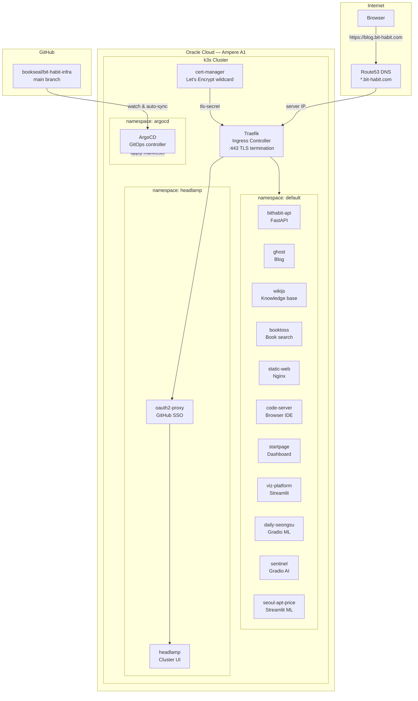
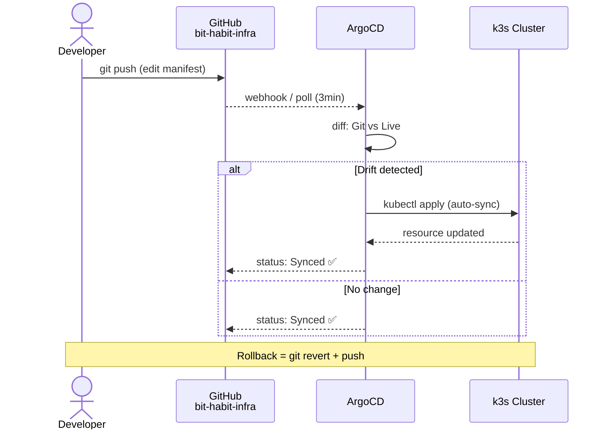
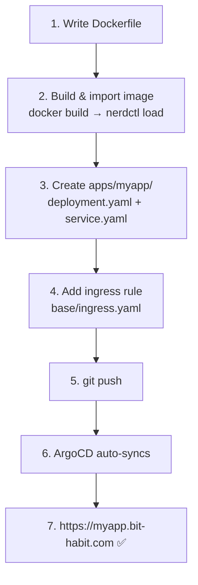
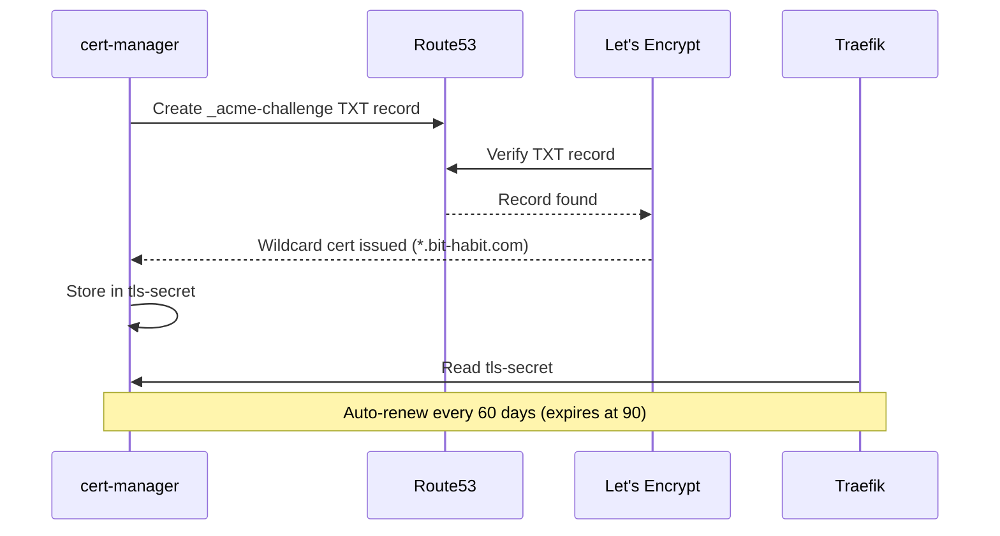
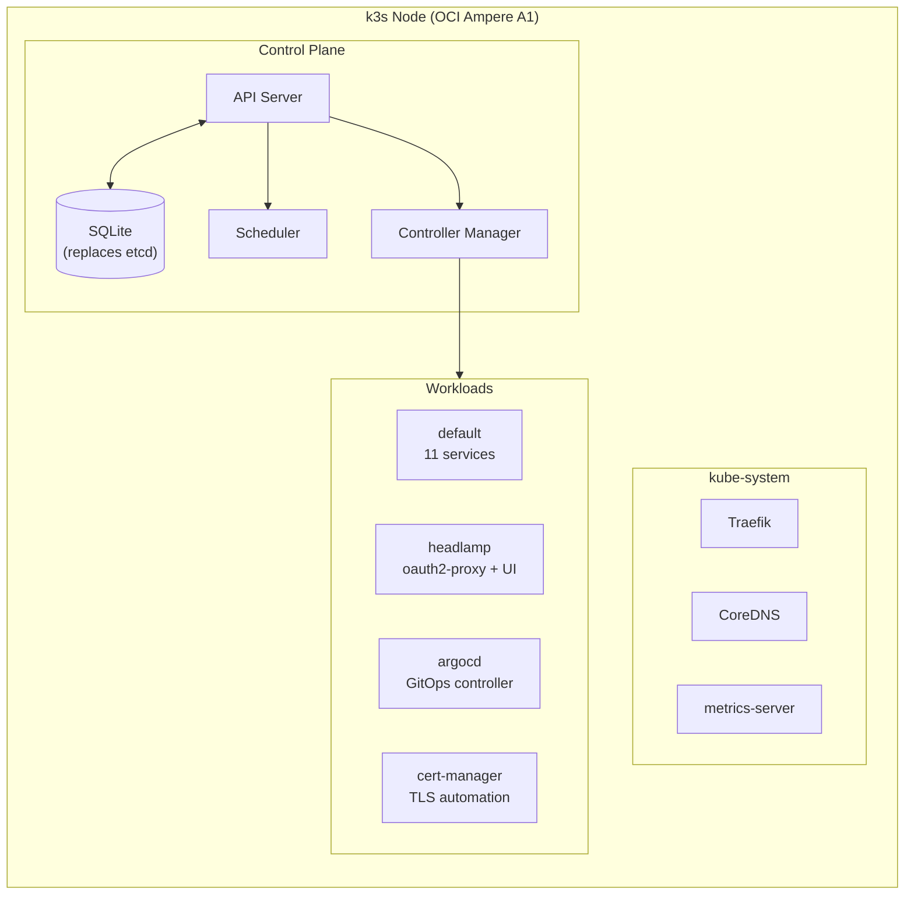

# bit-habit-infra

> GitOps infrastructure for a single-node k3s cluster on Oracle Cloud (OCI Ampere A1).  
> All services at `*.bit-habit.com` are defined here and auto-deployed by ArgoCD.

**14 services · $0/month · Zero manual kubectl apply**


---

## Why This Exists

Every side project I build gets deployed with a custom domain. If it's not live, I don't care about it.

But managing 10+ projects with separate Nginx configs got messy fast. So I built a proper platform:

| Before | After |
|---|---|
| AWS EC2 (paid) | **OCI Ampere A1 (free tier)** |
| Manual Nginx config × 10 | **k3s + Traefik auto-routing** |
| Manual SSL renewal | **cert-manager auto-renewal (every 60 days)** |
| Manual kubectl apply | **ArgoCD GitOps auto-sync** |
| ~$50/month | **$0/month** |

**Git is the single source of truth.** No manual `kubectl apply`. Ever.

---

## Architecture



---

## GitOps Workflow



---

## How to Deploy

### Add a new service



### Update an existing service

```
docker build -t myapp:latest .
→ nerdctl -n k8s.io load < myapp.tar
→ kubectl rollout restart deploy/myapp
→ Rolling update (zero downtime)
```

### Roll back

```
git revert + push → ArgoCD syncs to previous state
```

---

## TLS Certificates



One wildcard cert covers all subdomains. Fully automatic.

---

## Service Catalog (14 Services)

| Service | Subdomain | Port | Stack |
|---------|-----------|------|-------|
| **sentinel** | sentinel.bit-habit.com | 7860 | Gradio AI assistant |
| **booktoss** | booktoss.bit-habit.com | 8000 | Streamlit + Playwright |
| **bithabit-api** | habit.bit-habit.com/api/* | 8000 | FastAPI + SQLite |
| **static-web** | bit-habit.com, habit, status | 80 | Nginx |
| **ghost** | blog.bit-habit.com | 2368 | Ghost + MySQL |
| **wikijs** | wiki.bit-habit.com | 3000 | Wiki.js + PostgreSQL |
| **viz-platform** | viz.bit-habit.com | 8501 | Streamlit + Manim |
| **seoul-apt-price** | seoul-apt.bit-habit.com | 8501 | Streamlit ML |
| **code-server** | code-server.bit-habit.com | 8080 | VS Code in browser |
| **startpage** | startpage.bit-habit.com | 8000 | Custom dashboard |
| **daily-seongsu** | daily-seongsu.bit-habit.com | 7860 | Gradio ML |
| **headlamp** | k8s.bit-habit.com | 4466 | Cluster dashboard |
| **oauth2-proxy** | k8s.bit-habit.com (gate) | 4180 | GitHub SSO |
| **argocd** | argocd.bit-habit.com | — | GitOps controller |

---

## Design Decisions

| Decision | Choice | Why |
|----------|--------|-----|
| **GitOps tool** | ArgoCD | Auto-sync, drift detection, self-heal, web UI |
| **Ingress** | Single `base/ingress.yaml` | One routing table — easy to audit |
| **TLS** | Wildcard via DNS-01 | One cert for all subdomains |
| **Storage** | hostPath | Single node — simple and enough |
| **Image pull** | `Never` (local builds) | No registry needed |
| **Cost** | OCI free tier | ARM64, 4 cores, 24GB RAM — $0/month |

---

## Cluster Layout



---

## Repo Structure

```
bit-habit-infra/
├── base/                          # Cluster-wide infra
│   ├── ingress.yaml               #   Routing: subdomain → service
│   ├── cert-manager/              #   TLS: Let's Encrypt + Route53
│   │   ├── cluster-issuer.yaml
│   │   ├── certificate.yaml
│   │   └── aws-secret.yaml
│   └── middlewares/
│       └── strip-api-middleware.yaml
│
├── apps/                          # Per-service deployments
│   ├── argocd/
│   ├── bithabit-api/
│   ├── booktoss/
│   ├── code-server/
│   ├── daily-seongsu/
│   ├── ghost/
│   ├── headlamp/
│   ├── oauth2-proxy/
│   ├── seoul-apt-price/
│   ├── sentinel/
│   ├── startpage/
│   ├── static-web/
│   ├── viz-platform/
│   └── wikijs/
│
├── k3s-bootstrap/                 # Host-level setup
│
├── docs/
│   ├── kubernetes-guide.md        # Zero-to-advanced k8s guide
│   └── argocd-guide.md            # ArgoCD setup & ops
│
└── assets/
    └── headlamp-cluster-map.png
```

---

## Docs

| Document | What's inside |
|----------|---------------|
| [Kubernetes Guide](docs/kubernetes-guide.md) | Learn k8s from scratch using this cluster as a live example |
| [ArgoCD Guide](docs/argocd-guide.md) | Setup, architecture, daily ops, CLI, troubleshooting |

---

Built on OCI Ampere A1. Managed by ArgoCD. $0/month.
