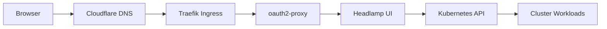
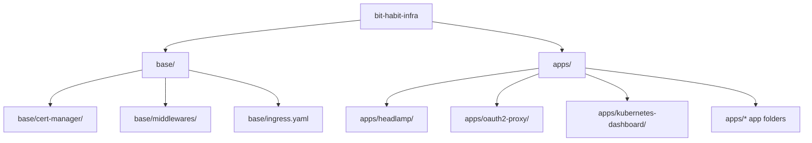
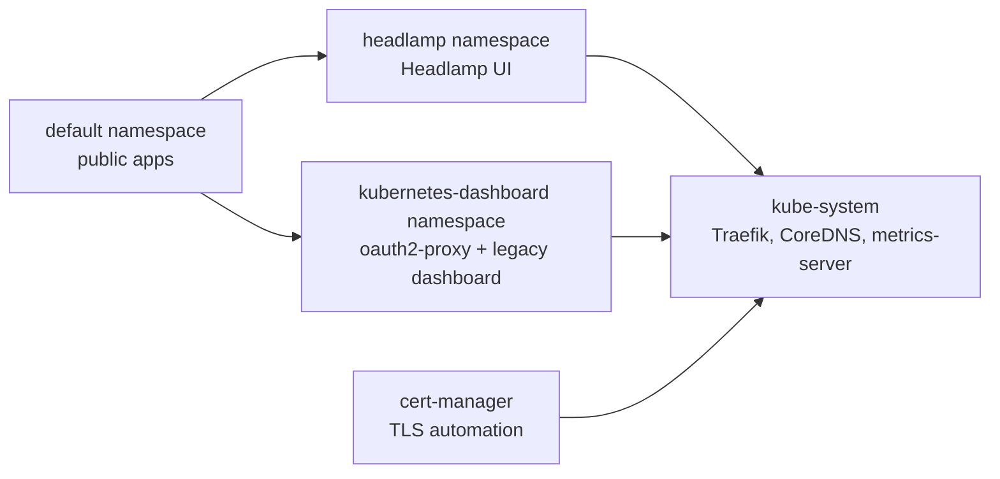
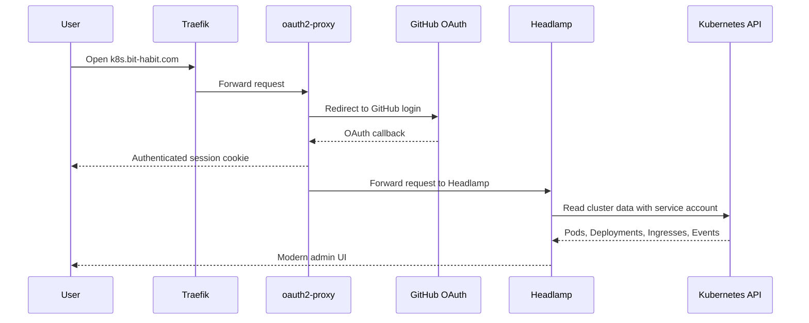
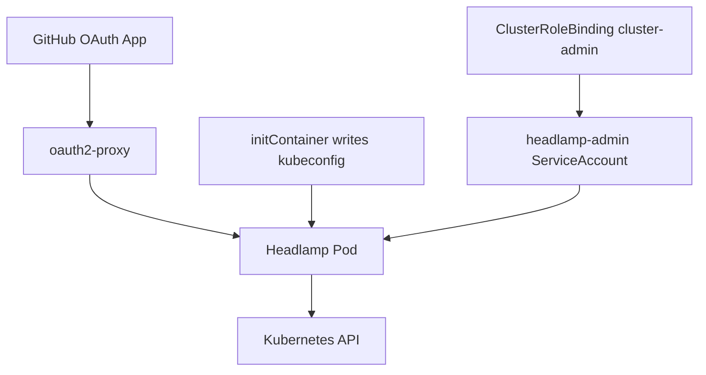
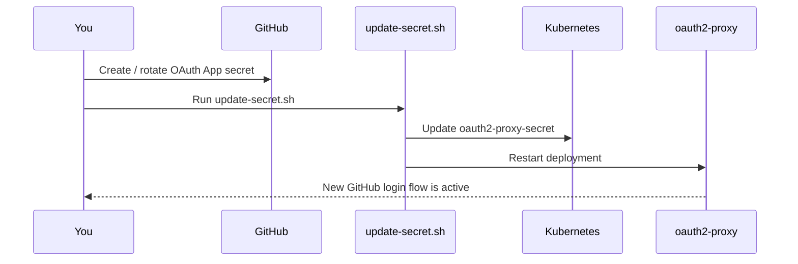
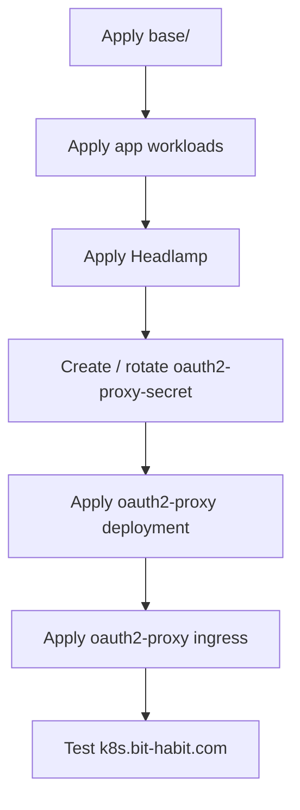
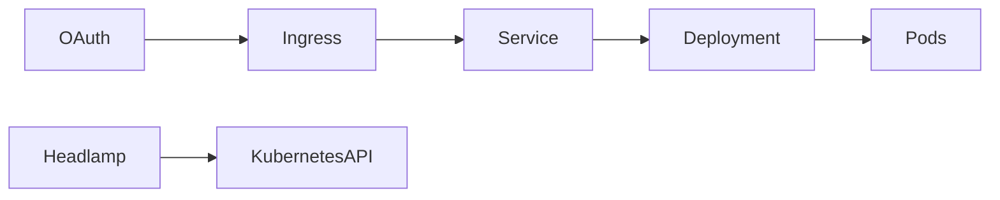

# bit-habit-infra

Infrastructure manifests for the `bit-habit.com` k3s cluster.

This repository is for people who want to:

- deploy apps to the cluster
- understand how traffic enters the cluster
- understand how GitHub login protects the admin UI
- learn the basic Kubernetes objects used in this repo

The admin UI for `https://k8s.bit-habit.com` is now **Headlamp** behind **GitHub OAuth**.

## 1. What This Repo Does

This repo stores plain Kubernetes YAML files.

It manages:

- public websites
- internal admin access
- TLS certificates
- Traefik routing
- GitHub OAuth login for the admin UI

## 2. High-Level Architecture



## 3. Public Domains

| Domain | Main Service |
| --- | --- |
| `bit-habit.com` | `static-web` |
| `blog.bit-habit.com` | `ghost` |
| `startpage.bit-habit.com` | `startpage` |
| `wiki.bit-habit.com` | `wikijs` |
| `habit.bit-habit.com` | `static-web` + `bithabit-api` |
| `booktoss.bit-habit.com` | `booktoss` |
| `viz.bit-habit.com` | `viz-platform` |
| `k8s.bit-habit.com` | `Headlamp` |

## 4. Repo Layout



## 5. Kubernetes Basics Used Here

If you are new to Kubernetes, these are the most important objects in this repo:

| Object | Meaning | Example in this repo |
| --- | --- | --- |
| `Namespace` | A logical folder inside the cluster | `headlamp`, `kubernetes-dashboard`, `default` |
| `Deployment` | Keeps Pods running | `apps/headlamp/deployment.yaml` |
| `Pod` | A running container unit | `headlamp`, `oauth2-proxy`, app Pods |
| `Service` | Stable internal network name for Pods | `headlamp`, `oauth2-proxy`, `static-web-svc` |
| `Ingress` | Public HTTP/HTTPS route | `main-ingress` |
| `IngressRoute` | Traefik CRD route | `k8s-dashboard-oauth` |
| `Secret` | Sensitive value storage | `oauth2-proxy-secret` |
| `ConfigMap` | Non-secret app config | dashboard / nginx / app settings |
| `ServiceAccount` | Cluster identity for a Pod | `headlamp-admin` |
| `ClusterRoleBinding` | Grants cluster-wide permissions | `headlamp-admin` |

## 6. Namespace Map



## 7. Admin Access Flow

`k8s.bit-habit.com` is protected in two layers:

1. `oauth2-proxy` checks GitHub login
2. Headlamp uses the in-cluster `headlamp-admin` service account



## 8. Why Headlamp Replaced Kubernetes Dashboard

The old Kubernetes Dashboard deployment in this repo used `kubernetesui/dashboard:v2.7.0`.

That version still returned API data, but on this cluster it did not render workload rows correctly in the UI.

Headlamp is now used because:

- it has a newer frontend
- it works well with modern clusters
- it gives a better navigation model
- it supports cluster views, search, and custom resources cleanly

The old dashboard files are still kept as a fallback reference in `apps/kubernetes-dashboard/`.

## 9. Headlamp Architecture



## 10. Important Files

### Cluster-wide

- `base/ingress.yaml`: main public ingress rules
- `base/cert-manager/`: TLS issuer and certificate resources
- `base/middlewares/`: reusable Traefik middleware

### Admin UI

- `apps/headlamp/deployment.yaml`: Headlamp deployment, service account, service
- `apps/oauth2-proxy/deployment.yaml`: GitHub OAuth proxy config
- `apps/oauth2-proxy/ingress.yaml`: Traefik route for `k8s.bit-habit.com`
- `apps/oauth2-proxy/update-secret.sh`: safe secret rotation helper

### Legacy

- `apps/kubernetes-dashboard/`: old dashboard reference only

## 11. Quick Start

### Apply base resources

```bash
kubectl apply -f base/
```

### Apply Headlamp

```bash
kubectl apply -f apps/headlamp/deployment.yaml
```

### Apply GitHub OAuth protection

```bash
kubectl apply -f apps/oauth2-proxy/deployment.yaml
kubectl apply -f apps/oauth2-proxy/ingress.yaml
```

## 12. GitHub OAuth App Setup

Create a GitHub OAuth App with:

- Application name: `k8s-dashboard` or a similar internal admin name
- Homepage URL: `https://k8s.bit-habit.com`
- Authorization callback URL: `https://k8s.bit-habit.com/oauth2/callback`

Then store:

- `Client ID`
- `Client Secret`

in the `oauth2-proxy-secret`.

## 13. Secret Update Flow

`apps/oauth2-proxy/update-secret.sh` updates the live secret safely.



### Example

```bash
cd apps/oauth2-proxy

OAUTH2_PROXY_COOKIE_SECRET="$(kubectl -n kubernetes-dashboard get secret oauth2-proxy-secret -o jsonpath='{.data.cookie-secret}' | base64 -d)" \
OAUTH2_PROXY_CLIENT_ID="YOUR_CLIENT_ID" \
OAUTH2_PROXY_CLIENT_SECRET="YOUR_CLIENT_SECRET" \
./update-secret.sh
```

## 14. How Headlamp Gets Cluster Access

Headlamp is not using your local kubeconfig file.

It uses:

- the `headlamp-admin` service account
- a generated kubeconfig inside the Pod
- the Kubernetes API service inside the cluster

This means:

- GitHub controls who can open the admin UI
- the service account controls what the UI can do inside the cluster

Right now, `headlamp-admin` is bound to `cluster-admin`.

That is simple and useful, but also powerful.

## 15. Security Note

Current admin access model:

- public URL is protected by GitHub OAuth
- authenticated users get access to a `cluster-admin` Headlamp session

This is convenient, but high privilege.

If you want stricter access later, reduce one or both of these:

- restrict GitHub users or GitHub orgs in `apps/oauth2-proxy/deployment.yaml`
- replace `cluster-admin` with narrower RBAC

## 16. Verify the Setup

### Basic cluster checks

```bash
kubectl get ns
kubectl get pods -A
kubectl get ingress -A
kubectl get ingressroute -A
```

### Headlamp checks

```bash
kubectl get pods -n headlamp
kubectl logs deploy/headlamp -n headlamp --tail=100
```

### OAuth checks

```bash
kubectl get pods -n kubernetes-dashboard
kubectl logs deploy/oauth2-proxy -n kubernetes-dashboard --tail=100
```

## 17. Troubleshooting

### GitHub login does not start

Check:

- `apps/oauth2-proxy/ingress.yaml`
- `oauth2-proxy-secret`
- GitHub OAuth App callback URL

### GitHub redirects to 404

Check:

- `Client ID`
- `Client Secret`
- callback URL exact match
- browser is using the latest values

### Headlamp asks for a token

Check:

- `kubectl logs deploy/headlamp -n headlamp`
- whether `/home/headlamp/.config/Headlamp/kubeconfigs/config` is being used
- whether the `headlamp-admin` service account exists

### Admin UI opens but shows no resources

Check:

- current namespace filter in the UI
- `kubectl get pods -A`
- `kubectl get ingress -A`
- Headlamp Pod logs

### Traefik route is wrong

Check:

- `kubectl get ingressroute -A`
- `kubectl describe ingressroute k8s-dashboard-oauth -n kubernetes-dashboard`

## 18. Deployment Order



## 19. Current App Inventory

Public apps mostly run in the `default` namespace.

Examples:

- `bithabit-api`
- `booktoss`
- `code-server`
- `ghost`
- `startpage`
- `static-web`
- `viz-platform`
- `wikijs`

Admin components run in:

- `headlamp`
- `kubernetes-dashboard`

## 20. Legacy Dashboard Status

The old Kubernetes Dashboard is:

- kept in the repo as a reference
- not the main admin UI anymore
- not the public target for `k8s.bit-habit.com`

## 21. Notes for New Contributors

If you are new to this repo:

1. read this README once
2. inspect the `apps/` folder for a single app
3. learn how `Deployment`, `Service`, and `Ingress` connect
4. learn the OAuth flow before changing `k8s.bit-habit.com`

The most important lesson:



Public traffic reaches Pods only through routing layers.

Admin traffic reaches the cluster through both:

- a public auth layer
- an internal Kubernetes identity
