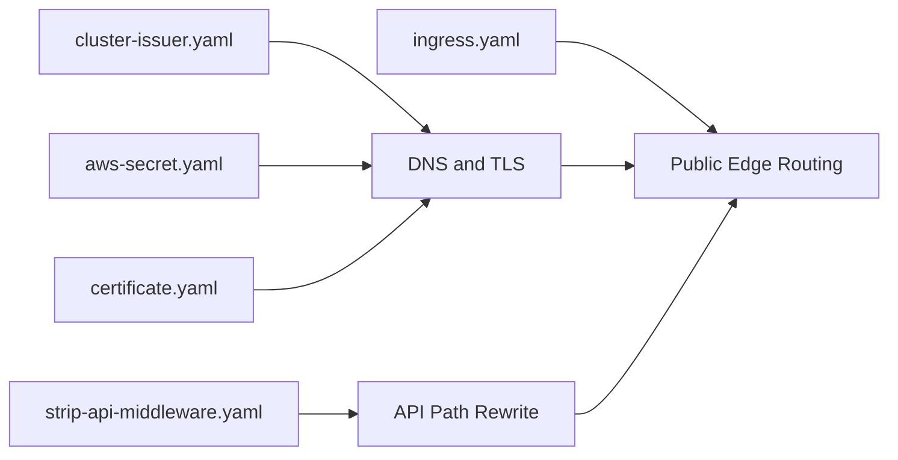
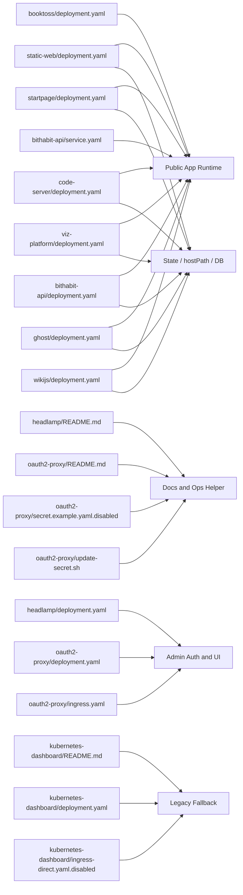
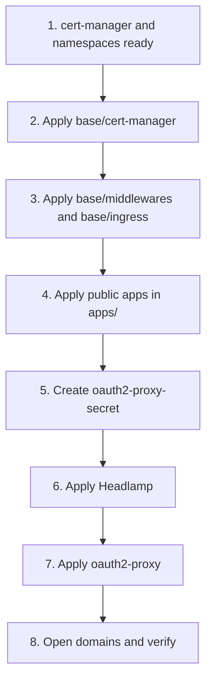
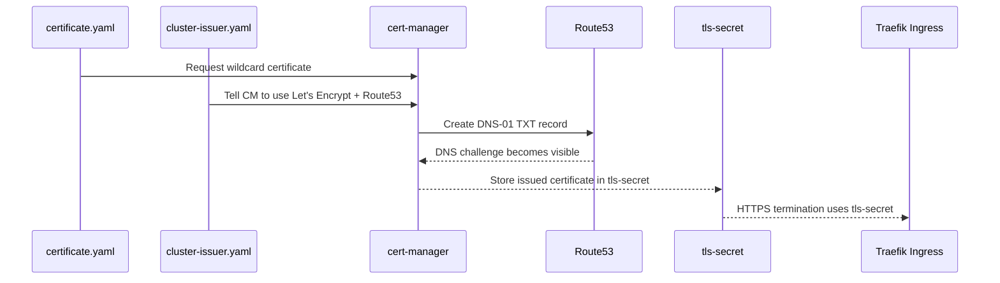
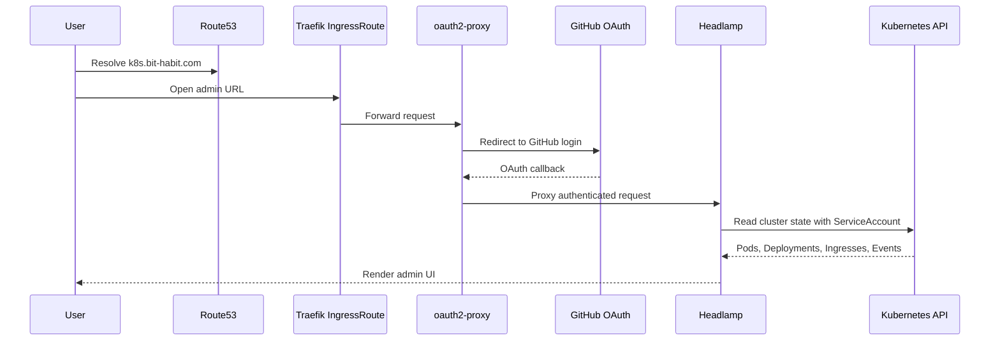

# bit-habit-infra

`bit-habit.com` k3s 클러스터를 운영하는 Kubernetes manifest 저장소입니다.

이 저장소는 다음을 다룹니다.

- `Route53` 기반 DNS / DNS-01 인증
- `cert-manager` 기반 TLS 발급
- `Traefik` ingress 라우팅
- 공개 서비스 배포
- 마지막에 설명하는 admin UI (`Headlamp` + `oauth2-proxy`)

## 1. 이 저장소를 한 문장으로

이 저장소는 `Route53 -> k3s -> Traefik -> Ingress -> Service -> Pod` 흐름으로 `bit-habit.com` 계열 서비스를 운영하고, `cert-manager`로 와일드카드 인증서를 관리하는 YAML 모음입니다.

## 2. 초보자가 먼저 봐야 할 전체 흐름

처음에는 admin UI를 빼고, 공개 서비스가 어떻게 동작하는지만 이해하면 됩니다.


이 그림에서 초보자가 기억해야 할 핵심은 아래 4개입니다.

1. 사용자는 먼저 `Route53`을 통해 서버 IP를 찾습니다.
2. `Traefik`이 외부 HTTP/HTTPS 요청을 받아 어떤 `Service`로 보낼지 결정합니다.
3. `Service`는 실제 컨테이너가 떠 있는 `Pod`로 요청을 전달합니다.
4. TLS 인증서는 `cert-manager`가 `Route53 DNS-01` 검증으로 발급해서 `tls-secret`에 넣고, Ingress가 그 secret을 사용합니다.

## 3. 이 repo를 읽는 가장 쉬운 순서

1. 이 README의 2번 그림을 먼저 봅니다.
2. `base/` 파일이 클러스터 입구를 어떻게 만드는지 봅니다.
3. `apps/`에서 서비스 하나만 골라 `Deployment + Service` 연결을 봅니다.
4. 마지막에 admin UI 섹션을 읽습니다.

## 4. 이 repo에서 자주 보는 Kubernetes 객체

| 객체 | 뜻 | 이 repo에서 하는 일 |
| --- | --- | --- |
| `Deployment` | Pod를 원하는 개수로 유지 | 앱, DB, Headlamp, oauth2-proxy 실행 |
| `Service` | Pod 앞의 고정 네트워크 이름 | Ingress가 붙는 내부 목적지 |
| `Ingress` | 공개 HTTP/HTTPS 라우팅 | 여러 도메인을 앱 Service로 연결 |
| `IngressRoute` | Traefik 전용 라우팅 CRD | `k8s.bit-habit.com` admin 라우팅 |
| `Secret` | 민감한 값 저장 | Route53 자격증명, OAuth secret, DB 비밀번호 |
| `ConfigMap` | 일반 설정 저장 | nginx 설정 |
| `ServiceAccount` | Pod가 클러스터에 접근할 때 쓰는 신원 | Headlamp가 Kubernetes API를 읽을 때 사용 |
| `ClusterRoleBinding` | 권한 부여 | Headlamp / legacy dashboard에 cluster-wide 권한 연결 |
| `Certificate` | cert-manager에 인증서 요청 | `bit-habit.com` 와일드카드 TLS 생성 |
| `ClusterIssuer` | 인증서 발급 방법 정의 | Let’s Encrypt + Route53 DNS-01 설정 |

## 5. 시작 전에 알아야 할 운영 특성

- 이 저장소는 `Helm`, `Terraform`, `Kustomize`, CI 없이 plain YAML 중심으로 운영됩니다.
- 여러 앱이 `hostPath`를 사용하므로, k3s 노드의 로컬 디렉터리 구조에 의존합니다.
- 여러 앱 이미지가 `imagePullPolicy: Never` 이므로, 노드에 이미지가 이미 준비되어 있어야 합니다.
- 이 repo만 `kubectl apply`한다고 모든 것이 끝나지는 않습니다. 외부 `Secret`, `ConfigMap`, namespace가 몇 가지 더 필요합니다.

필수로 존재해야 하는 외부 리소스는 아래와 같습니다.

- `cert-manager` 설치 및 `cert-manager` namespace
- `kubernetes-dashboard` namespace
- `basic-auth`
- `nginx-conf`
- `booktoss-env`
- `ghost-mysql-pass`
- `wikijs-db-pass`
- `oauth2-proxy-secret`

## 6. `base/` 전체 파일 설명

`base/`는 "클러스터 입구"를 담당합니다. 즉, 인증서, 공용 도메인 라우팅, Traefik middleware가 여기 있습니다.

| 파일 | 무엇을 정의하나 | infra flow에서 맡는 위치 | 초보자 메모 |
| --- | --- | --- | --- |
| `base/cert-manager/cluster-issuer.yaml` | Let’s Encrypt production `ClusterIssuer`와 `Route53` DNS-01 solver | DNS / TLS 발급 시작점 | 인증서를 어떤 방식으로 발급할지 정의합니다. |
| `base/cert-manager/aws-secret.yaml` | `route53-credentials-secret` | DNS / TLS 발급 자격증명 | cert-manager가 Route53에 TXT 레코드를 만들 때 씁니다. |
| `base/cert-manager/certificate.yaml` | `bit-habit.com`, `*.bit-habit.com` 인증서 요청 | DNS / TLS 발급 결과 생성 | 최종 결과는 `tls-secret`입니다. |
| `base/ingress.yaml` | 메인 공개 `Ingress`와 `habit.bit-habit.com/api/` 전용 `Ingress` | 공용 트래픽 진입점 | 어떤 도메인이 어떤 Service로 가는지 대부분 여기서 결정됩니다. |
| `base/middlewares/strip-api-middleware.yaml` | `/api` prefix 제거용 Traefik `Middleware` | API path 정리 | `habit.bit-habit.com/api/...` 요청을 백엔드가 이해하는 경로로 바꿉니다. |

## 7. `apps/` 전체 파일 설명

`apps/`는 실제 workload를 담습니다. 공개 서비스, admin UI, 운영용 스크립트, legacy 참고 파일이 함께 들어 있습니다.

### 7.1 공개 서비스 파일

| 파일 | 무엇을 정의하나 | infra flow에서 맡는 위치 | 초보자 메모 |
| --- | --- | --- | --- |
| `apps/static-web/deployment.yaml` | `static-web` Deployment + Service | 공개 웹 런타임 | `bit-habit.com`, `habit.bit-habit.com`, `status.bit-habit.com` 같은 정적 사이트 진입점입니다. 여러 `hostPath`, `ConfigMap`, `Secret`에 의존합니다. |
| `apps/startpage/deployment.yaml` | `startpage` Deployment + Service | 공개 웹 런타임 | `startpage.bit-habit.com`을 담당합니다. |
| `apps/booktoss/deployment.yaml` | `booktoss` Deployment + Service | 공개 웹 런타임 | `booktoss-env` Secret이 필요합니다. |
| `apps/code-server/deployment.yaml` | `code-server` Deployment + Service | 공개 웹 런타임 | 브라우저 기반 개발 환경입니다. 로컬 workspace를 `hostPath`로 마운트합니다. |
| `apps/viz-platform/deployment.yaml` | `viz-platform` Deployment + Service | 공개 웹 런타임 | 시각화 앱을 실행합니다. 앱 소스를 `hostPath`로 직접 마운트합니다. |
| `apps/bithabit-api/deployment.yaml` | `bithabit-api` Deployment + Service | 공개 API 런타임 | 기본 모드는 클러스터 안에서 API를 직접 띄우는 방식입니다. |
| `apps/bithabit-api/service.yaml` | `bithabit-api-svc` Service + Endpoints | 외부 API 백엔드 연결 | 대체 모드입니다. `10.0.0.61:8002` 외부 엔드포인트로 보냅니다. `deployment.yaml`과 동시에 적용하면 충돌 가능성이 있습니다. |
| `apps/ghost/deployment.yaml` | `ghost-mysql`, `ghost` Deployment + Service | 공개 웹 + 내부 DB | 블로그와 MySQL을 함께 정의합니다. 데이터는 `hostPath`에 저장됩니다. |
| `apps/wikijs/deployment.yaml` | `wikijs-db`, `wikijs` Deployment + Service | 공개 웹 + 내부 DB | Wiki.js와 PostgreSQL을 함께 정의합니다. |

### 7.2 admin UI와 운영 파일

| 파일 | 무엇을 정의하나 | infra flow에서 맡는 위치 | 초보자 메모 |
| --- | --- | --- | --- |
| `apps/headlamp/README.md` | Headlamp 운영 설명 | 운영 문서 | 실제 적용 파일은 아니고, admin UI 설명서입니다. |
| `apps/headlamp/deployment.yaml` | `headlamp` namespace, ServiceAccount, ClusterRoleBinding, Deployment, Service | admin UI 본체 | Headlamp가 Kubernetes API를 읽기 위한 in-cluster 구성을 담고 있습니다. |
| `apps/oauth2-proxy/README.md` | GitHub OAuth 설정 설명 | 운영 문서 | oauth2-proxy를 어떻게 설치하고 검증하는지 설명합니다. |
| `apps/oauth2-proxy/deployment.yaml` | oauth2-proxy Deployment + Service | admin 인증 계층 | `k8s.bit-habit.com` 요청을 GitHub 로그인 뒤 Headlamp로 프록시합니다. |
| `apps/oauth2-proxy/ingress.yaml` | `k8s.bit-habit.com`용 Traefik `IngressRoute` | admin 진입점 | admin UI의 공개 URL은 여기서 시작합니다. |
| `apps/oauth2-proxy/secret.example.yaml.disabled` | 예시 OAuth secret 템플릿 | 운영 템플릿 | 비활성 예시 파일입니다. 그대로 apply 하지 않습니다. |
| `apps/oauth2-proxy/update-secret.sh` | OAuth secret 갱신 스크립트 | 운영 헬퍼 | GitHub OAuth credential을 안전하게 바꾸고 rollout restart까지 수행합니다. |

### 7.3 legacy 참고 파일

| 파일 | 무엇을 정의하나 | infra flow에서 맡는 위치 | 초보자 메모 |
| --- | --- | --- | --- |
| `apps/kubernetes-dashboard/README.md` | legacy dashboard 설명 | legacy 운영 문서 | 현재 메인 admin UI는 아닙니다. 참고용입니다. |
| `apps/kubernetes-dashboard/deployment.yaml` | legacy dashboard용 ServiceAccount, ClusterRoleBinding, 토큰 Secret | legacy admin 권한 | 공식 dashboard가 이미 설치되어 있다는 전제가 있습니다. |
| `apps/kubernetes-dashboard/ingress-direct.yaml.disabled` | legacy dashboard 직접 노출용 `IngressRoute` | legacy admin 라우팅 | 현재는 비활성 파일입니다. oauth2-proxy를 쓰지 않을 때만 되살립니다. |

## 8. 파일이 infra flow 어디에서 동작하는지

### 8.1 `base/` 파일 흐름



### 8.2 `apps/` 파일 흐름



이 두 그림을 보면 바로 구분할 수 있습니다.

- `base/`는 클러스터 입구를 만듭니다.
- `apps/`는 실제 서비스를 띄웁니다.
- admin UI는 공개 앱과 별개로 뒤쪽에 따로 붙습니다.
- `.disabled` 파일과 각종 `README.md`, 스크립트는 운영 보조 자료입니다.

## 9. 현재 도메인과 연결 대상

아래 표는 실제 routing 결과를 한 번에 보여줍니다.

| Host | 경로 | 연결 대상 | 출처 파일 |
| --- | --- | --- | --- |
| `bit-habit.com` | `/` | `static-web-svc` | `base/ingress.yaml` |
| `www.bit-habit.com` | `/` | `static-web-svc` | `base/ingress.yaml` |
| `blog.bit-habit.com` | `/` | `ghost-svc` | `base/ingress.yaml` |
| `www.blog.bit-habit.com` | `/` | `ghost-svc` | `base/ingress.yaml` |
| `booktoss.bit-habit.com` | `/` | `booktoss-svc` | `base/ingress.yaml` |
| `code-server.bit-habit.com` | `/` | `code-server-svc` | `base/ingress.yaml` |
| `daily-seongsu.bit-habit.com` | `/` | `daily-seongsu-svc` | `base/ingress.yaml` |
| `habit.bit-habit.com` | `/` | `static-web-svc` | `base/ingress.yaml` |
| `habit.bit-habit.com` | `/api/` | `bithabit-api-svc` + strip `/api` | `base/ingress.yaml`, `base/middlewares/strip-api-middleware.yaml` |
| `startpage.bit-habit.com` | `/` | `startpage-svc` | `base/ingress.yaml` |
| `status.bit-habit.com` | `/` | `static-web-svc` | `base/ingress.yaml` |
| `seoul-apt.bit-habit.com` | `/` | `seoul-apt-price` | `base/ingress.yaml` |
| `viz.bit-habit.com` | `/` | `viz-platform-svc` | `base/ingress.yaml` |
| `wiki.bit-habit.com` | `/` | `wikijs-svc` | `base/ingress.yaml` |
| `www.wiki.bit-habit.com` | `/` | `wikijs-svc` | `base/ingress.yaml` |
| `k8s.bit-habit.com` | `/` | `oauth2-proxy -> Headlamp` | `apps/oauth2-proxy/ingress.yaml` |

주의할 점:

- `daily-seongsu-svc`
- `seoul-apt-price`

위 두 Service는 현재 이 repo의 `apps/` 아래 manifest가 보이지 않습니다. 즉, 다른 경로에서 관리되거나 아직 누락된 상태일 수 있습니다.

## 10. 초보자 기준 적용 순서

가장 안전한 읽기 순서는 "입구 먼저, 앱 나중"입니다.



대표 명령은 아래와 같습니다.

```bash
kubectl apply -f base/cert-manager/
kubectl apply -f base/middlewares/
kubectl apply -f base/ingress.yaml

kubectl apply -f apps/static-web/deployment.yaml
kubectl apply -f apps/startpage/deployment.yaml
kubectl apply -f apps/booktoss/deployment.yaml
kubectl apply -f apps/ghost/deployment.yaml
kubectl apply -f apps/wikijs/deployment.yaml

kubectl apply -f apps/headlamp/deployment.yaml
kubectl apply -f apps/oauth2-proxy/deployment.yaml
kubectl apply -f apps/oauth2-proxy/ingress.yaml
```

`oauth2-proxy-secret`는 apply 전에 먼저 준비해야 합니다.

## 11. 인증서 발급이 어떻게 동작하는가

이 저장소는 `AWS Route53`를 사용합니다. 핵심은 cert-manager가 Route53에 DNS-01 TXT 레코드를 만들고, 검증이 끝나면 `tls-secret`을 만든다는 점입니다.



초보자 관점에서는 아래처럼 기억하면 됩니다.

- `cluster-issuer.yaml`은 "어떻게 발급할지"를 말합니다.
- `aws-secret.yaml`은 "Route53에 접근할 자격증명"입니다.
- `certificate.yaml`은 "무슨 도메인 인증서를 만들지"를 말합니다.
- `tls-secret`은 "Ingress가 실제로 쓰는 결과물"입니다.

## 12. 마지막으로 보는 admin UI 흐름

공개 서비스 구조를 이해한 뒤에, 마지막으로 admin UI를 보면 훨씬 쉽습니다.

`k8s.bit-habit.com`은 일반 앱처럼 바로 Headlamp로 가지 않습니다. 먼저 `oauth2-proxy`를 통과하고, GitHub OAuth가 성공해야만 Headlamp로 들어갑니다.



여기서 파일별 역할은 이렇게 나뉩니다.

- `apps/oauth2-proxy/ingress.yaml`: `k8s.bit-habit.com` 공개 진입점
- `apps/oauth2-proxy/deployment.yaml`: GitHub 로그인과 세션 처리
- `apps/headlamp/deployment.yaml`: 실제 Kubernetes UI와 ServiceAccount 권한
- `apps/oauth2-proxy/update-secret.sh`: GitHub OAuth secret 갱신 자동화

중요한 사실 하나:

- GitHub 로그인은 "누가 UI에 들어오느냐"를 결정합니다.
- Headlamp ServiceAccount 권한은 "들어온 사람이 클러스터 안에서 무엇을 보느냐"를 결정합니다.

## 13. GitHub OAuth 준비와 secret 생성

`k8s.bit-habit.com`을 쓰려면 먼저 GitHub OAuth App이 있어야 합니다.

최소 설정값:

- Application name: `k8s-dashboard` 또는 비슷한 내부 이름
- Homepage URL: `https://k8s.bit-habit.com`
- Authorization callback URL: `https://k8s.bit-habit.com/oauth2/callback`

그 다음 `oauth2-proxy-secret`를 만듭니다.

```bash
COOKIE_SECRET=$(openssl rand -base64 32 | head -c 32)

kubectl create secret generic oauth2-proxy-secret \
  -n kubernetes-dashboard \
  --from-literal=cookie-secret="$COOKIE_SECRET" \
  --from-literal=client-id="YOUR_GITHUB_CLIENT_ID" \
  --from-literal=client-secret="YOUR_GITHUB_CLIENT_SECRET" \
  --dry-run=client -o yaml | kubectl apply -f -
```

이미 운영 중인 secret 값을 바꾸려면 `apps/oauth2-proxy/update-secret.sh`를 사용합니다.

```bash
cd apps/oauth2-proxy

export OAUTH2_PROXY_COOKIE_SECRET='your-cookie-secret'
export OAUTH2_PROXY_CLIENT_ID='your-client-id'
export OAUTH2_PROXY_CLIENT_SECRET='your-client-secret'

./update-secret.sh
```

## 14. 기본 검증 방법

```bash
kubectl get ns
kubectl get pods -A
kubectl get ingress -A
kubectl get ingressroute -A
```

Headlamp 확인:

```bash
kubectl get pods -n headlamp
kubectl logs deploy/headlamp -n headlamp --tail=100
```

oauth2-proxy 확인:

```bash
kubectl get pods -n kubernetes-dashboard
kubectl logs deploy/oauth2-proxy -n kubernetes-dashboard --tail=100
```

## 15. 초보자가 자주 헷갈리는 지점

### `Service`는 앱이 아니다

`Service`는 트래픽을 받는 고정 이름이고, 실제 컨테이너는 `Deployment -> Pod`가 띄웁니다.

### `Ingress`는 입구일 뿐이다

`Ingress`는 도메인과 경로를 보고 어느 `Service`로 보낼지 결정합니다. 앱 로직은 `Ingress` 안에 없습니다.

### `hostPath`는 노드 디렉터리에 직접 의존한다

앱을 다른 노드로 옮기면 같은 경로와 데이터가 없어서 깨질 수 있습니다.

### `bithabit-api`는 두 가지 모드가 있다

- `apps/bithabit-api/deployment.yaml`: 클러스터 내부에 API를 직접 띄우는 방식
- `apps/bithabit-api/service.yaml`: 외부 IP `10.0.0.61:8002`로 보내는 방식

둘 다 같은 `bithabit-api-svc`를 다루므로, 의도 없이 함께 apply 하면 혼란이 생깁니다.

### `.disabled` 파일은 기본적으로 적용 대상이 아니다

파일명을 바꾸기 전까지는 일반적인 `kubectl apply -f ...` 대상이 아닙니다.

## 16. 새로 들어온 사람이 기억해야 할 한 줄

이 repo를 이해하는 가장 빠른 방법은 "`base/`는 입구, `apps/`는 실제 서비스, admin UI는 마지막"이라고 기억하는 것입니다.
