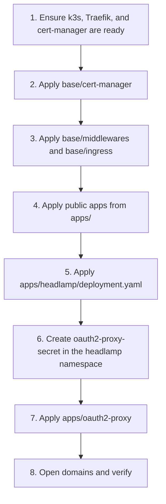
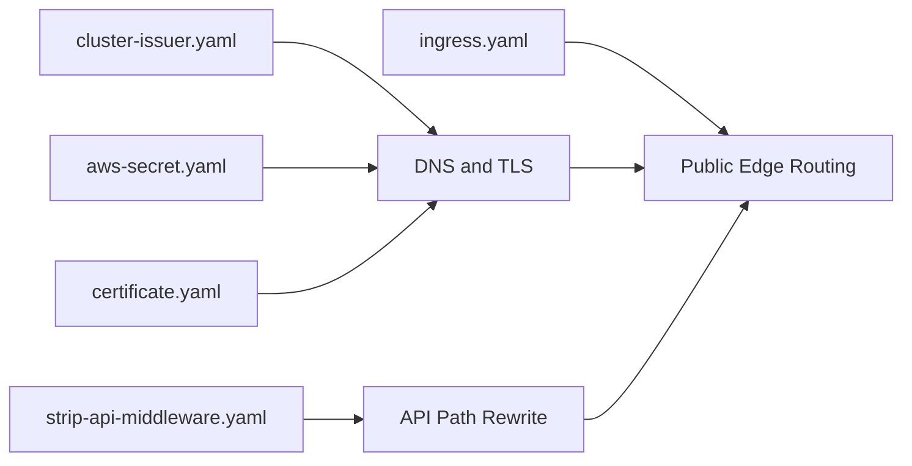
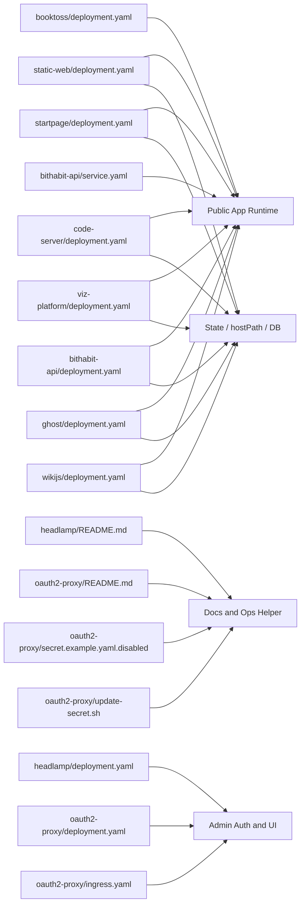
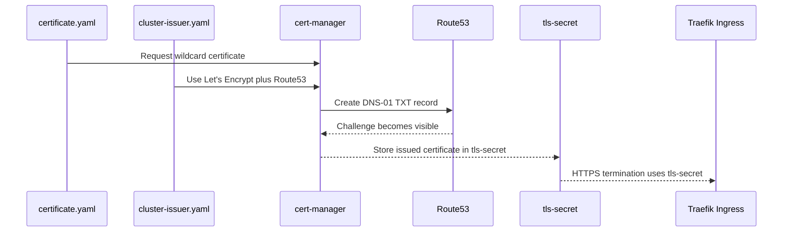
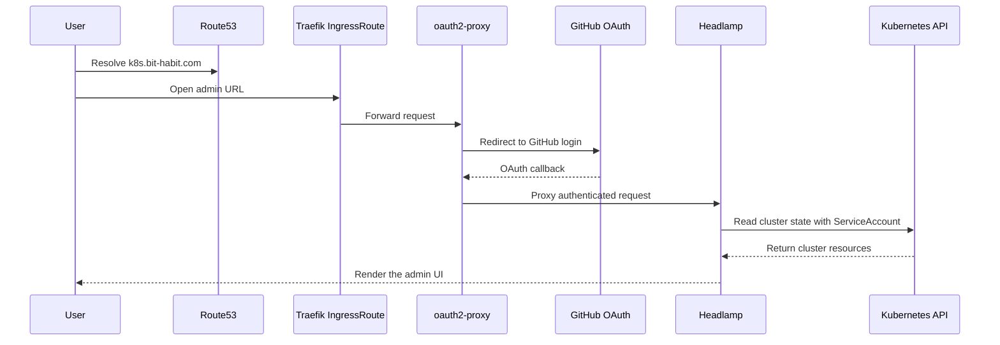

# bit-habit-infra

Kubernetes manifests for the `bit-habit.com` k3s cluster.

This repo manages:

- `Route53` DNS and DNS-01 validation
- `cert-manager` TLS issuance
- `Traefik` ingress routing
- public application workloads
- the admin entrypoint for `k8s.bit-habit.com` using `Headlamp` and `oauth2-proxy`

## 1. Beginner-First Deployment Order

If you only need the shortest path to understanding or applying this repo, start here.



Prerequisites:

- a working `k3s` cluster with `Traefik`
- `cert-manager` installed and running
- required external resources such as `basic-auth`, `nginx-conf`, `booktoss-env`, `ghost-mysql-pass`, `wikijs-db-pass`

Typical commands:

```bash
kubectl apply -f base/cert-manager/
kubectl apply -f base/middlewares/
kubectl apply -f base/ingress.yaml

kubectl apply -f apps/static-web/deployment.yaml
kubectl apply -f apps/startpage/deployment.yaml
kubectl apply -f apps/booktoss/deployment.yaml
kubectl apply -f apps/ghost/deployment.yaml
kubectl apply -f apps/wikijs/deployment.yaml

kubectl apply -f apps/headlamp/deployment.yaml

kubectl create secret generic oauth2-proxy-secret \
  -n headlamp \
  --from-literal=cookie-secret="YOUR_COOKIE_SECRET" \
  --from-literal=client-id="YOUR_GITHUB_CLIENT_ID" \
  --from-literal=client-secret="YOUR_GITHUB_CLIENT_SECRET" \
  --dry-run=client -o yaml | kubectl apply -f -

kubectl apply -f apps/oauth2-proxy/deployment.yaml
kubectl apply -f apps/oauth2-proxy/ingress.yaml
```

## 2. Public Admin Entry Screen

This is the public landing screen currently shown at `https://k8s.bit-habit.com` before GitHub authentication. The screenshot was captured on **March 18, 2026 (UTC)**.


What this means operationally:

- the public URL is fronted by `oauth2-proxy`
- unauthenticated users see the GitHub sign-in page first
- `Headlamp` only appears after successful GitHub OAuth

## 3. This Repo in One Sentence

This repo runs `bit-habit.com` workloads through the flow `Route53 -> k3s -> Traefik -> Ingress -> Service -> Pod`, while `cert-manager` issues the wildcard TLS certificate and `Headlamp` provides the cluster admin UI behind GitHub OAuth.

## 4. Understand the Public Traffic Flow First

Start with public traffic before looking at the admin UI.


Four things to remember:

1. `Route53` resolves the domain and also participates in `DNS-01` validation.
2. `Traefik` is the public ingress controller at the edge of the cluster.
3. `Ingress` maps hostnames and paths to internal `Service` objects.
4. `Service` sends traffic to the actual application `Pod` objects.

## 5. The Fastest Way to Read This Repo

1. Read section 1 first.
2. Read the `base/` files as the "front door" of the cluster.
3. Pick one app under `apps/` and trace `Deployment -> Service -> Ingress`.
4. Read the admin UI sections last.

## 6. Kubernetes Objects Used Here

| Object | Meaning | What it does in this repo |
| --- | --- | --- |
| `Deployment` | Keeps Pods running | Runs apps, databases, Headlamp, and oauth2-proxy |
| `Service` | Stable internal network name for Pods | Gives Ingress a target to forward traffic to |
| `Ingress` | Public HTTP/HTTPS route | Connects domains to internal Services |
| `IngressRoute` | Traefik-specific routing CRD | Exposes `k8s.bit-habit.com` through oauth2-proxy |
| `Secret` | Sensitive value storage | Stores Route53 credentials, OAuth values, DB passwords |
| `ConfigMap` | Non-secret configuration | Stores nginx configuration |
| `ServiceAccount` | Kubernetes identity for a Pod | Lets Headlamp talk to the Kubernetes API |
| `ClusterRoleBinding` | Permission grant | Gives Headlamp cluster-wide access |
| `Certificate` | cert-manager certificate request | Requests the wildcard TLS certificate |
| `ClusterIssuer` | Certificate issuance policy | Tells cert-manager to use Let's Encrypt and Route53 |

## 7. Operational Characteristics

- This repo uses plain YAML. There is no `Helm`, `Terraform`, `Kustomize`, or CI pipeline here.
- Several apps depend on `hostPath`, so they are tied to the node filesystem layout.
- Several app images use `imagePullPolicy: Never`, so images must already exist on the node.
- Not every dependency lives in this repo. Some `Secret` and `ConfigMap` objects must already exist.

## 8. `base/` File Inventory

`base/` is the cluster front door: certificates, shared ingress, and shared Traefik middleware.

| File | What it defines | Where it acts in the flow | Beginner note |
| --- | --- | --- | --- |
| `base/cert-manager/cluster-issuer.yaml` | The production `ClusterIssuer` using Let’s Encrypt and the `Route53` DNS-01 solver | DNS and TLS issuance | This defines how certificates are issued. |
| `base/cert-manager/aws-secret.yaml` | `route53-credentials-secret` | DNS and TLS issuance | cert-manager uses this to create Route53 DNS challenge records. |
| `base/cert-manager/certificate.yaml` | Wildcard certificate request for `bit-habit.com` and `*.bit-habit.com` | DNS and TLS issuance | The result becomes `tls-secret`. |
| `base/ingress.yaml` | The main public `Ingress` plus a dedicated `/api/` `Ingress` for `habit.bit-habit.com` | Public routing | Most domain-to-service mapping starts here. |
| `base/middlewares/strip-api-middleware.yaml` | Traefik `Middleware` that strips `/api` | API path normalization | This makes `/api/...` requests match what the backend expects. |

## 9. `apps/` File Inventory

`apps/` holds the actual workloads, admin components, and operator helper files.

### 9.1 Public application files

| File | What it defines | Where it acts in the flow | Beginner note |
| --- | --- | --- | --- |
| `apps/static-web/deployment.yaml` | `static-web` Deployment and Service | Public web runtime | Serves `bit-habit.com`, `habit.bit-habit.com`, and `status.bit-habit.com` content. Uses multiple `hostPath` mounts plus `ConfigMap` and `Secret` inputs. |
| `apps/startpage/deployment.yaml` | `startpage` Deployment and Service | Public web runtime | Serves `startpage.bit-habit.com`. |
| `apps/booktoss/deployment.yaml` | `booktoss` Deployment and Service | Public web runtime | Depends on the `booktoss-env` Secret. |
| `apps/code-server/deployment.yaml` | `code-server` Deployment and Service | Public web runtime | Exposes a browser-based coding environment and mounts the node workspace with `hostPath`. |
| `apps/viz-platform/deployment.yaml` | `viz-platform` Deployment and Service | Public web runtime | Mounts the source tree directly from the node with `hostPath`. |
| `apps/bithabit-api/deployment.yaml` | `bithabit-api` Deployment and Service | Public API runtime | Runs the API inside the cluster. |
| `apps/bithabit-api/service.yaml` | `bithabit-api-svc` Service and manual `Endpoints` | External API backend mode | This is an alternative mode that forwards to `10.0.0.61:8002`. Do not apply it together with the in-cluster Service unless that is intentional. |
| `apps/ghost/deployment.yaml` | `ghost-mysql` and `ghost` Deployments plus Services | Public web and internal database | Runs the blog and its MySQL database with `hostPath` data. |
| `apps/wikijs/deployment.yaml` | `wikijs-db` and `wikijs` Deployments plus Services | Public web and internal database | Runs Wiki.js and PostgreSQL. |

### 9.2 Admin and operator files

| File | What it defines | Where it acts in the flow | Beginner note |
| --- | --- | --- | --- |
| `apps/headlamp/README.md` | Headlamp-specific operational notes | Operator docs | Explains the in-cluster Headlamp setup. |
| `apps/headlamp/deployment.yaml` | The `headlamp` namespace, ServiceAccount, ClusterRoleBinding, Deployment, and Service | Admin UI runtime | This is the actual Headlamp deployment. |
| `apps/oauth2-proxy/README.md` | oauth2-proxy setup notes | Operator docs | Explains GitHub OAuth setup and troubleshooting. |
| `apps/oauth2-proxy/deployment.yaml` | oauth2-proxy Deployment and Service | Admin authentication layer | Handles GitHub login before traffic reaches Headlamp. |
| `apps/oauth2-proxy/ingress.yaml` | Traefik `IngressRoute` for `k8s.bit-habit.com` | Admin public entrypoint | This is the public route for the admin UI. |
| `apps/oauth2-proxy/secret.example.yaml.disabled` | Example Secret template | Operator helper template | Sample values only. It should stay disabled. |
| `apps/oauth2-proxy/update-secret.sh` | Secret rotation helper script | Operator helper | Updates the GitHub OAuth Secret and restarts oauth2-proxy. |

## 10. Where Each File Fits in the Infrastructure Flow

### 10.1 `base/` file flow



### 10.2 `apps/` file flow



Summary:

- `base/` builds the edge and shared routing layer.
- `apps/` runs the actual workloads.
- admin access is separate from public app routing.
- `.disabled` files and `README.md` files are operational helpers, not default apply targets.

## 11. Current Domain Map

| Host | Path | Target | Source file |
| --- | --- | --- | --- |
| `bit-habit.com` | `/` | `static-web-svc` | `base/ingress.yaml` |
| `www.bit-habit.com` | `/` | `static-web-svc` | `base/ingress.yaml` |
| `blog.bit-habit.com` | `/` | `ghost-svc` | `base/ingress.yaml` |
| `www.blog.bit-habit.com` | `/` | `ghost-svc` | `base/ingress.yaml` |
| `booktoss.bit-habit.com` | `/` | `booktoss-svc` | `base/ingress.yaml` |
| `code-server.bit-habit.com` | `/` | `code-server-svc` | `base/ingress.yaml` |
| `daily-seongsu.bit-habit.com` | `/` | `daily-seongsu-svc` | `base/ingress.yaml` |
| `habit.bit-habit.com` | `/` | `static-web-svc` | `base/ingress.yaml` |
| `habit.bit-habit.com` | `/api/` | `bithabit-api-svc` plus `/api` stripping | `base/ingress.yaml`, `base/middlewares/strip-api-middleware.yaml` |
| `startpage.bit-habit.com` | `/` | `startpage-svc` | `base/ingress.yaml` |
| `status.bit-habit.com` | `/` | `static-web-svc` | `base/ingress.yaml` |
| `seoul-apt.bit-habit.com` | `/` | `seoul-apt-price` | `base/ingress.yaml` |
| `viz.bit-habit.com` | `/` | `viz-platform-svc` | `base/ingress.yaml` |
| `wiki.bit-habit.com` | `/` | `wikijs-svc` | `base/ingress.yaml` |
| `www.wiki.bit-habit.com` | `/` | `wikijs-svc` | `base/ingress.yaml` |
| `k8s.bit-habit.com` | `/` | `oauth2-proxy -> Headlamp` | `apps/oauth2-proxy/ingress.yaml` |

Two Services are referenced in ingress but do not currently have matching manifests in `apps/`:

- `daily-seongsu-svc`
- `seoul-apt-price`

That usually means they are managed elsewhere or are still missing from this repo.

## 12. How Route53 and cert-manager Issue TLS

This repo uses `AWS Route53`. cert-manager creates the DNS-01 challenge records in Route53, waits for validation, and then stores the certificate in `tls-secret`.



Remember it like this:

- `cluster-issuer.yaml` defines how issuance works.
- `aws-secret.yaml` provides Route53 credentials.
- `certificate.yaml` says which certificate to issue.
- `tls-secret` is the result consumed by ingress.

## 13. Admin UI Flow

After you understand public app routing, the admin path becomes much easier to follow.

`k8s.bit-habit.com` does not point directly to Headlamp. It first goes through `oauth2-proxy`, and only authenticated users reach Headlamp.



File roles in this flow:

- `apps/oauth2-proxy/ingress.yaml`: the public route
- `apps/oauth2-proxy/deployment.yaml`: GitHub OAuth, cookies, and proxying
- `apps/headlamp/deployment.yaml`: the Headlamp UI and Kubernetes API access
- `apps/oauth2-proxy/update-secret.sh`: Secret rotation helper

## 14. Can Headlamp Provide a Shell or kubectl Access?

In practical terms:

- Headlamp can inspect resources, show logs, and open pod-level exec sessions.
- Headlamp is still not a full browser shell environment in this repo.
- If you want a general-purpose browser shell or raw `kubectl` terminal from outside the cluster, this repo does not currently provide that.
- A reasonable next step is either the Headlamp desktop app with a local kubeconfig on an operator machine, or a separate web terminal service behind `oauth2-proxy` with tight RBAC and audit controls.

For this repo specifically, `Headlamp` should be treated as the cluster UI with targeted pod exec, not as a replacement for a dedicated shell host.

## 15. GitHub OAuth Setup

To expose `k8s.bit-habit.com`, first create a GitHub OAuth App with:

- Application name: `bit-habit-headlamp`
- Homepage URL: `https://k8s.bit-habit.com`
- Authorization callback URL: `https://k8s.bit-habit.com/oauth2/callback`

Then create the Secret:

```bash
COOKIE_SECRET=$(openssl rand -base64 32 | head -c 32)

kubectl create secret generic oauth2-proxy-secret \
  -n headlamp \
  --from-literal=cookie-secret="$COOKIE_SECRET" \
  --from-literal=client-id="YOUR_GITHUB_CLIENT_ID" \
  --from-literal=client-secret="YOUR_GITHUB_CLIENT_SECRET" \
  --dry-run=client -o yaml | kubectl apply -f -
```

To rotate the live Secret later:

```bash
cd apps/oauth2-proxy

export OAUTH2_PROXY_COOKIE_SECRET='your-cookie-secret'
export OAUTH2_PROXY_CLIENT_ID='your-client-id'
export OAUTH2_PROXY_CLIENT_SECRET='your-client-secret'

./update-secret.sh
```

## 16. Verification

General cluster checks:

```bash
kubectl get ns
kubectl get pods -A
kubectl get ingress -A
kubectl get ingressroute -A
```

Headlamp and oauth2-proxy checks:

```bash
kubectl get pods -n headlamp
kubectl logs deploy/headlamp -n headlamp --tail=100
kubectl logs deploy/oauth2-proxy -n headlamp --tail=100
```

## 17. Beginner Gotchas

### A `Service` is not the application itself

The real containers are in `Deployment -> Pod`. A `Service` is the stable network front for them.

### `Ingress` is only the front door

`Ingress` decides where traffic goes. It does not run the application code.

### `hostPath` couples workloads to one node

If you move a workload to another node without the same files and directories, it can break.

### `bithabit-api` has two different operating modes

- `apps/bithabit-api/deployment.yaml` runs the API inside the cluster.
- `apps/bithabit-api/service.yaml` forwards to an external IP `10.0.0.61:8002`.

They both touch `bithabit-api-svc`, so do not apply both casually.

### `.disabled` files are not part of the normal apply path

They are examples or optional files. They are not active until you intentionally rename or copy them.

## 18. One-Line Memory Aid

The simplest way to remember this repo is: `base/` is the front door, `apps/` is the runtime, and `Headlamp` sits behind `oauth2-proxy` for admin access.
