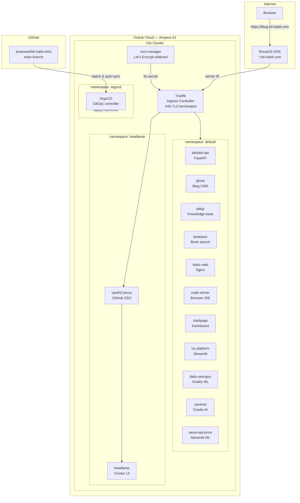
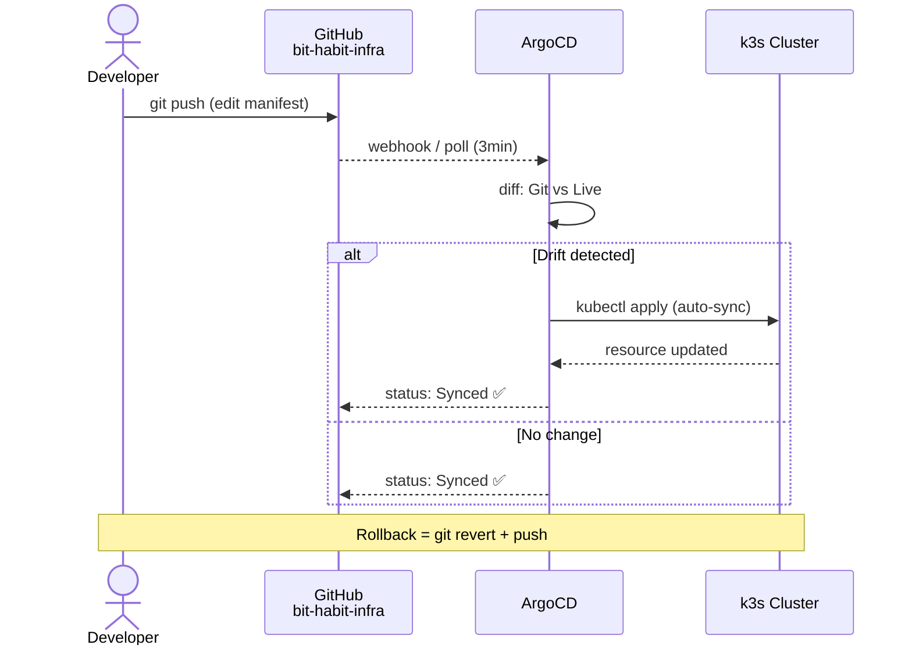
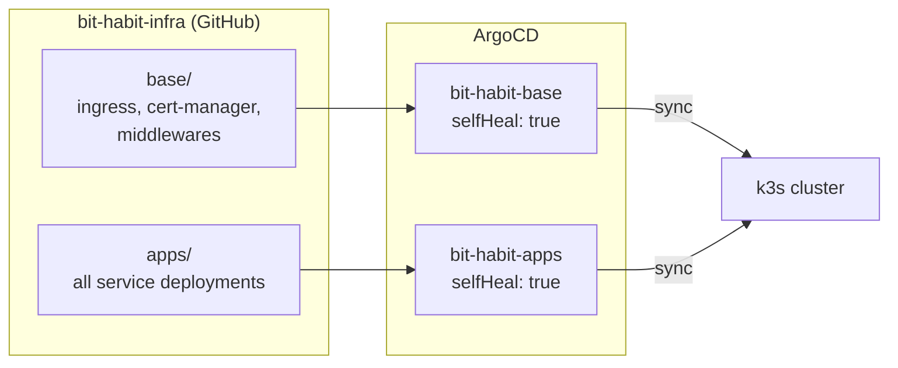
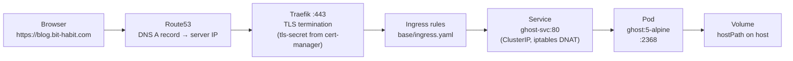
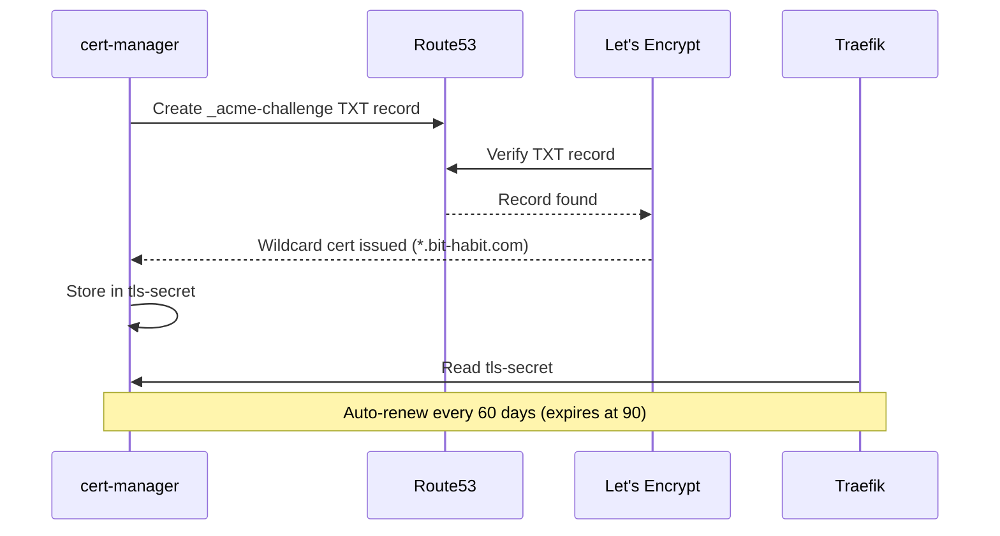
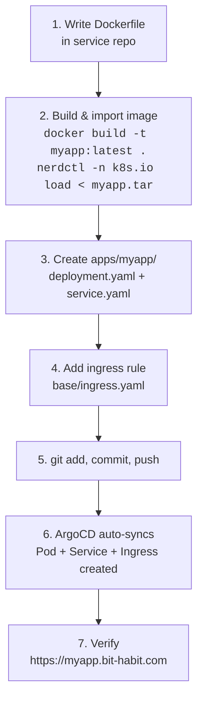
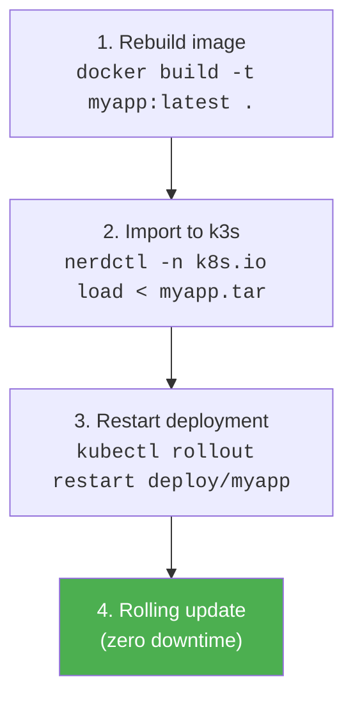
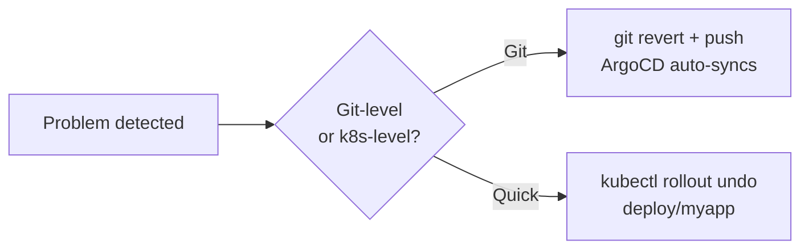
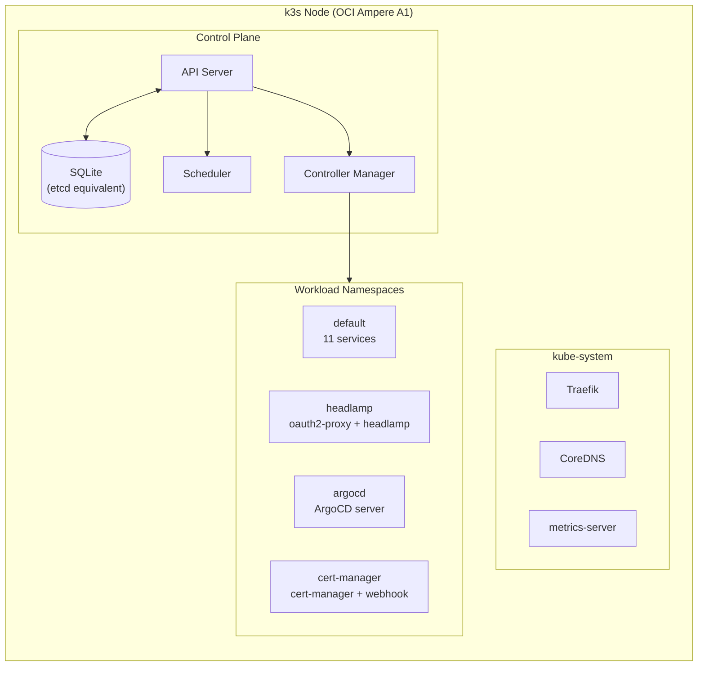

# bit-habit-infra

> GitOps infrastructure for a single-node k3s cluster on Oracle Cloud (OCI Ampere A1).
> All services at `*.bit-habit.com` are defined here and auto-deployed by ArgoCD.


---

## Architecture Overview



---

## GitOps Workflow

This is the standard deployment flow. **Git is the single source of truth** — no manual `kubectl apply`.



### ArgoCD Applications



---

## Traffic Flow

How a request reaches your app — every hop from browser to container:



### TLS Certificate Lifecycle



---

## Service Catalog

| Service | Subdomain | Port | Stack | Directory |
|---------|-----------|------|-------|-----------|
| **bithabit-api** | `habit.bit-habit.com/api/*` | 8000 | FastAPI + SQLite | `apps/bithabit-api/` |
| **static-web** | `bit-habit.com`, `habit`, `status` | 80 | Nginx | `apps/static-web/` |
| **ghost** | `blog.bit-habit.com` | 2368 | Ghost + MySQL | `apps/ghost/` |
| **wikijs** | `wiki.bit-habit.com` | 3000 | Wiki.js + PostgreSQL | `apps/wikijs/` |
| **booktoss** | `booktoss.bit-habit.com` | 8000 | Streamlit + Playwright | `apps/booktoss/` |
| **code-server** | `code-server.bit-habit.com` | 8080 | VS Code in browser | `apps/code-server/` |
| **viz-platform** | `viz.bit-habit.com` | 8501 | Streamlit | `apps/viz-platform/` |
| **startpage** | `startpage.bit-habit.com` | 8000 | Custom dashboard | `apps/startpage/` |
| **daily-seongsu** | `daily-seongsu.bit-habit.com` | 7860 | Gradio ML app | `apps/daily-seongsu/` |
| **sentinel** | `sentinel.bit-habit.com` | 7860 | Gradio AI assistant | `apps/sentinel/` |
| **seoul-apt-price** | `seoul-apt.bit-habit.com` | 8501 | Streamlit ML app | `apps/seoul-apt-price/` |
| **headlamp** | `k8s.bit-habit.com` | 4466 | Cluster dashboard | `apps/headlamp/` |
| **oauth2-proxy** | `k8s.bit-habit.com` (gate) | 4180 | GitHub SSO | `apps/oauth2-proxy/` |
| **argocd** | `argocd.bit-habit.com` | — | GitOps controller | `apps/argocd/` |

---

## Repository Structure

```
bit-habit-infra/
├── base/                          # Cluster-wide infrastructure
│   ├── ingress.yaml               #   Main routing: subdomain → service
│   ├── cert-manager/              #   TLS: Let's Encrypt + Route53 DNS-01
│   │   ├── cluster-issuer.yaml
│   │   ├── certificate.yaml
│   │   └── aws-secret.yaml
│   └── middlewares/
│       └── strip-api-middleware.yaml  # Strip /api prefix for FastAPI
│
├── apps/                          # Per-service deployments (ArgoCD watches this)
│   ├── argocd/                    #   ArgoCD Application + Ingress
│   ├── bithabit-api/              #   Deployment + Service
│   ├── booktoss/
│   ├── code-server/
│   ├── daily-seongsu/             #   Deployment + Service + PV/PVC
│   ├── ghost/
│   ├── headlamp/
│   ├── oauth2-proxy/
│   ├── seoul-apt-price/
│   ├── sentinel/
│   ├── startpage/
│   ├── static-web/
│   ├── viz-platform/
│   └── wikijs/
│
├── k3s-bootstrap/                 # Host-level setup (not applied by k8s)
│   ├── config.yaml.example
│   ├── install-server.sh.example
│   └── registries.yaml.example
│
├── docs/                          # Guides & documentation
│   ├── kubernetes-guide.md        #   K8s beginner's guidebook (zero → advanced)
│   └── argocd-guide.md            #   ArgoCD setup & operations guide
│
└── assets/
    └── headlamp-cluster-map.png
```

---

## Standard Deployment Workflow

### Adding a new service



### Updating an existing service



### Rolling back a deployment



---

## Cluster Topology



---

## Key Design Decisions

| Decision | Choice | Why |
|----------|--------|-----|
| **Manifest location** | Centralized in `bit-habit-infra/apps/` | ArgoCD recommended pattern for single-operator clusters. Single source of truth. |
| **GitOps tool** | ArgoCD | Auto-sync, drift detection, self-heal. Web UI at `argocd.bit-habit.com`. |
| **Ingress** | Single `base/ingress.yaml` | One routing table, one wildcard cert, easy to audit. |
| **TLS** | Wildcard `*.bit-habit.com` via DNS-01 | One cert covers all subdomains. Auto-renewed by cert-manager. |
| **Storage** | `hostPath` volumes | Single-node cluster. Simple and sufficient. Migrate to PVC for multi-node. |
| **Image pull** | `imagePullPolicy: Never` | Local builds imported to containerd. No registry needed. |
| **Secrets** | Out-of-band `kubectl create secret` | Never committed to Git. Consider Sealed Secrets for full GitOps. |

---

## Docs

| Document | Description |
|----------|-------------|
| [Kubernetes Beginner's Guidebook](docs/kubernetes-guide.md) | Zero-to-advanced k8s guide using this cluster as a live example |
| [ArgoCD Guide](docs/argocd-guide.md) | ArgoCD installation, architecture, daily ops, CLI, and troubleshooting |
