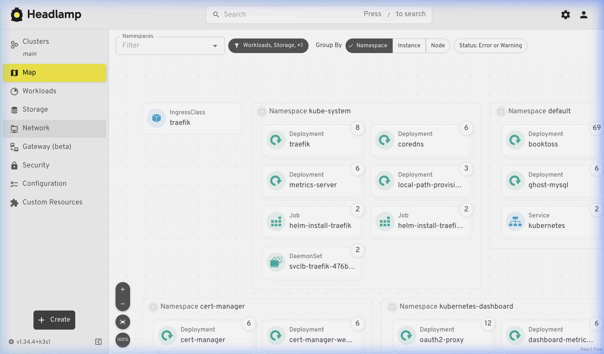
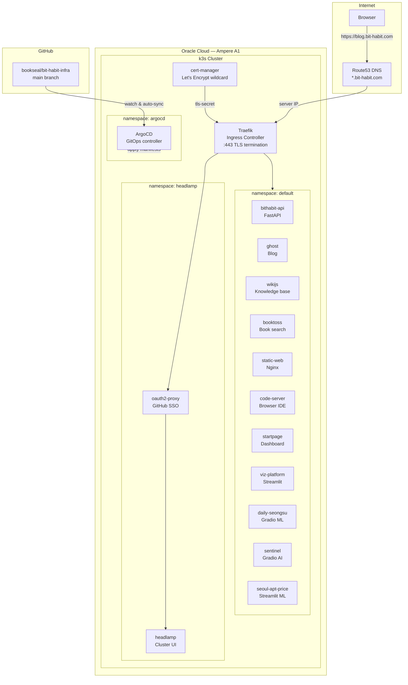
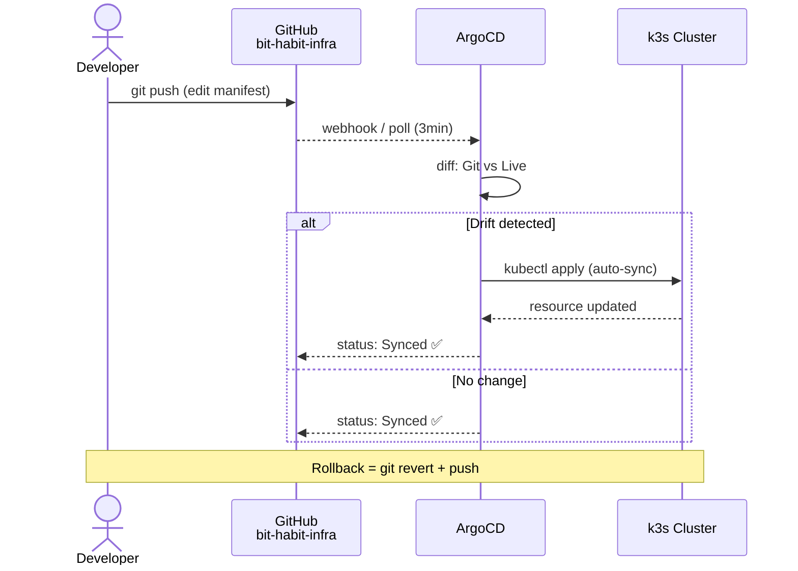
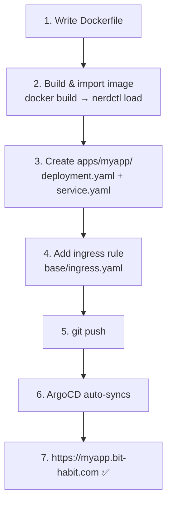
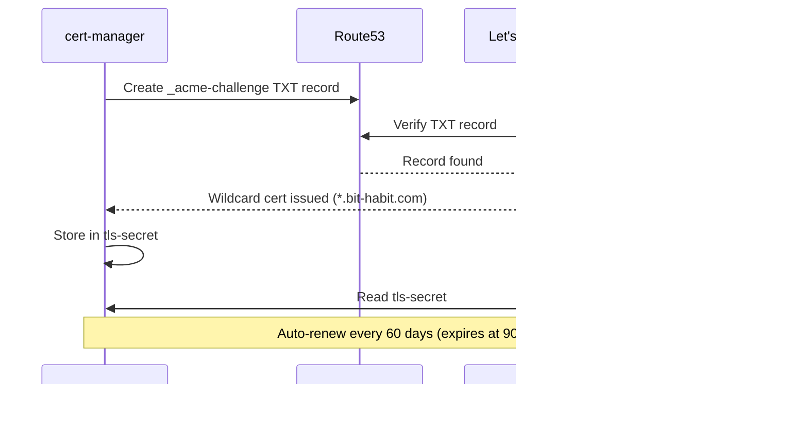
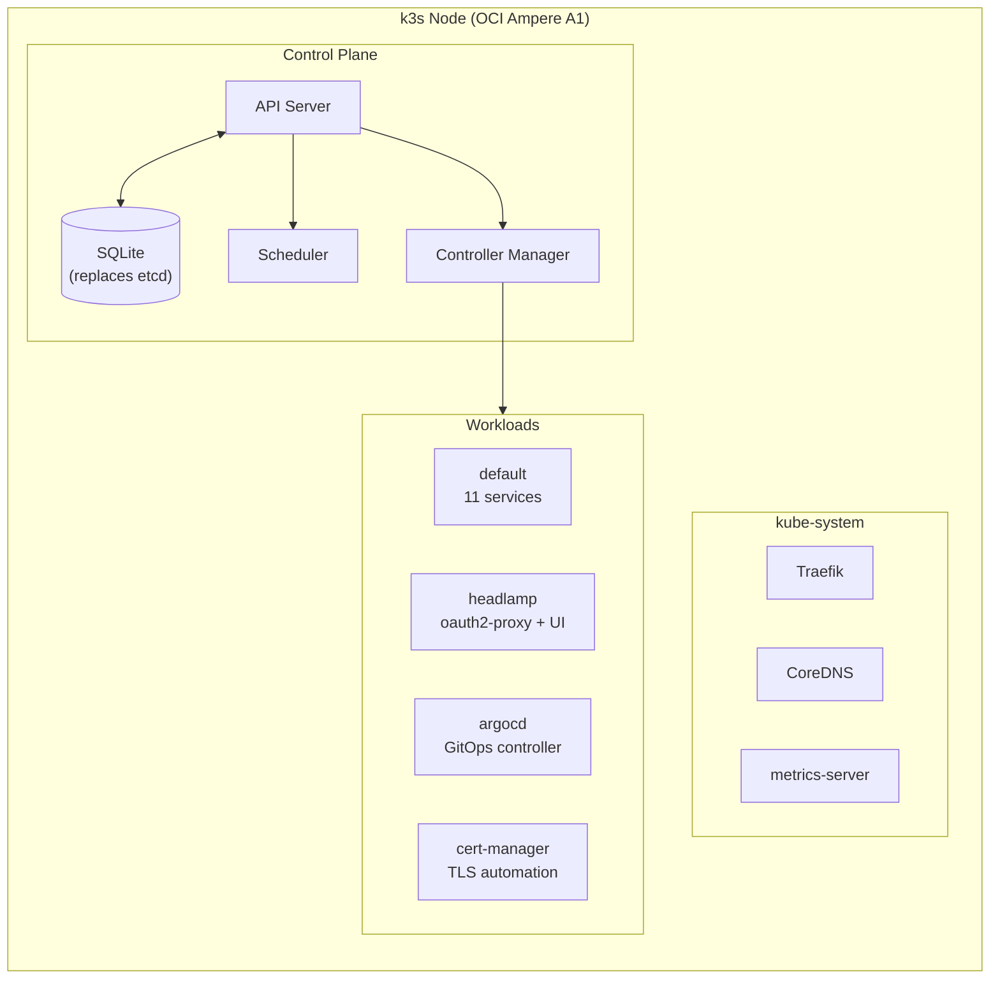

# bit-habit-infra

> GitOps infrastructure for a single-node k3s cluster on Oracle Cloud (OCI Ampere A1).  
> All services at `*.bit-habit.com` are defined here and auto-deployed by ArgoCD.

**14 services · $0/month · Zero manual kubectl apply**



---

## nginx는 아는데 k8s는 처음인 분께 (현재 세팅 한눈에)

이 클러스터는 결국 **"여러 개의 nginx 가상호스트를 자동으로 관리해 주는 시스템"** 이라고 보면 됩니다.
익숙한 nginx 개념에 1:1로 대응해서 정리했습니다.

| 이 클러스터의 것 | nginx로 치면 | 하는 일 |
|---|---|---|
| **Traefik** | nginx 본체(리버스 프록시) | 호스트의 **80/443 포트를 직접 점유**하고 TLS 종료 + 라우팅 |
| **Ingress** (`base/ingress.yaml`) | `server { server_name ...; location / { proxy_pass ...; } }` 블록들 | "어떤 서브도메인 → 어떤 백엔드"를 적어둔 라우팅 표 |
| **Service (ClusterIP)** | `upstream { server ...; }` | 백엔드 풀(파드들)을 가리키는 안정적인 내부 주소 |
| **Pod** | 실제 앱 프로세스(gunicorn/node 등) | 컨테이너로 도는 실제 애플리케이션 |
| **cert-manager** | certbot | Let's Encrypt 와일드카드 인증서 자동 발급·갱신 |
| **k3s** | nginx를 띄워주는 systemd + 그 이상 | 컨테이너를 스케줄링·재시작·관리하는 경량 쿠버네티스 |
| **ArgoCD** | "git pull 후 `nginx -s reload`"를 자동으로 하는 데몬 | Git을 진실로 보고, 바뀌면 클러스터에 자동 반영 |
| **kubectl** | `nginx -t`, `systemctl`, `tail -f access.log` | 상태 조회·제어 CLI |
| **static-web** (아래 카탈로그) | 그냥 **nginx 정적 서빙 그대로** | 호스트 폴더(`/home/ubuntu/workspace/static-web`)를 nginx 컨테이너가 서빙 |

### 지금 외부 요청이 들어오는 경로 (엣지 네트워킹)

`https://bit-habit.com` 한 번 누르면 이렇게 흐릅니다.


```mermaid
flowchart LR
    U["브라우저"] -->|"DNS: *.bit-habit.com"| OCI["OCI 공인IP 158.180.71.122\n→ 인스턴스 10.0.0.61"]
    OCI -->|":80"| T80["Traefik :80 (hostPort)"]
    OCI -->|":443"| T443["Traefik :443 (hostPort)\nTLS 종료 (와일드카드 인증서)"]
    T80 -->|"308 리디렉션"| T443
    T443 -->|"Host 헤더로 매칭"| ING["Ingress 규칙\nbase/ingress.yaml"]
    ING --> SVC["Service (ClusterIP)"]
    SVC --> POD["Pod (앱 컨테이너)"]
```

**핵심:** Traefik 파드가 `hostPort: 80, 443` 으로 호스트의 80/443을 **직접 물고** 있습니다.
즉 nginx가 호스트에서 `listen 80; listen 443 ssl;` 하는 것과 똑같습니다. 별도 OCI 로드밸런서 없이
공인IP 트래픽이 인스턴스의 80/443으로 들어와 곧장 Traefik으로 갑니다.

nginx 설정으로 비유하면 현재 엣지는 대략 이렇습니다:

```nginx
# (개념 비유 — 실제로는 Traefik이 이 역할을 함)
server {
    listen 80;
    server_name *.bit-habit.com;
    return 308 https://$host$request_uri;     # ← http → https 강제 (entrypoint redirect)
}
server {
    listen 443 ssl;
    server_name *.bit-habit.com;
    ssl_certificate     /etc/.../tls-secret;  # ← cert-manager가 자동 갱신 (certbot 역할)
    # location 별 proxy_pass = Ingress 규칙(base/ingress.yaml)이 담당
}
```

### 엣지 설정은 어디에 있나 (중요)

위 엣지(Traefik) 설정만은 **이 GitOps 저장소(`apps/`)가 아니라 호스트의 k3s 애드온 파일**에 있습니다.
nginx.conf가 레포가 아니라 서버에 사는 것과 같은 맥락입니다.

- 파일: 호스트 `/var/lib/rancher/k3s/server/manifests/traefik-config.yaml` (`HelmChartConfig`)
- 내용 요약:
  - `ports.web.hostPort: 80`, `ports.websecure.hostPort: 443` → 호스트 80/443 직접 점유
  - `additionalArguments`로 **web(80) → :443 https 308 영구 리디렉션** 적용
  - `updateStrategy.type: Recreate` → 단일 노드에서 hostPort는 두 파드가 동시에 못 잡으므로,
    업데이트 시 **옛 파드를 먼저 내리고 새로 띄움**(그 사이 수 초 끊김 — nginx 재시작과 동일한 트레이드오프)
- 이 파일을 바꾸면 k3s가 자동 감지해 Traefik을 재배포합니다(헬름 업그레이드). ArgoCD 대상이 아닙니다.

> 최근 변경(2026-06-24): `http://`(80) 접속이 응답하지 않던 문제를 고쳤습니다.
> Traefik을 호스트 80/443에 hostPort로 직접 바인딩하고, 80→443 영구 리디렉션을 추가했습니다.
> 이제 `http://bit-habit.com` → `https://bit-habit.com` 로 자동 전환됩니다.

---

## Why This Exists

Every side project I build gets deployed with a custom domain. If it's not live, I don't care about it.

But managing 10+ projects with separate Nginx configs got messy fast. So I built a proper platform:

| Before | After |
|---|---|
| AWS EC2 (paid) | **OCI Ampere A1 (free tier)** |
| Manual Nginx config × 10 | **k3s + Traefik auto-routing** |
| Manual SSL renewal | **cert-manager auto-renewal (every 60 days)** |
| Manual kubectl apply | **ArgoCD GitOps auto-sync** |
| ~$50/month | **$0/month** |

**Git is the single source of truth.** No manual `kubectl apply`. Ever.

---

## Architecture


```mermaid
flowchart TB
    subgraph Internet
        USER["Browser"]
        DNS["Route53 DNS\n*.bit-habit.com"]
    end

    subgraph OCI["Oracle Cloud — Ampere A1"]
        subgraph K3S["k3s Cluster"]
            TRAEFIK["Traefik\nIngress Controller\n:443 TLS termination"]
            CM["cert-manager\nLet's Encrypt wildcard"]

            subgraph NS_DEFAULT["namespace: default"]
                API["bithabit-api\nFastAPI"]
                GHOST["ghost\nBlog"]
                WIKI["wikijs\nKnowledge base"]
                BOOKTOSS["booktoss\nBook search"]
                STATIC["static-web\nNginx"]
                CODE["code-server\nBrowser IDE"]
                START["startpage\nDashboard"]
                VIZ["viz-platform\nStreamlit"]
                DAILY["daily-seongsu\nGradio ML"]
                SENTINEL["sentinel\nGradio AI"]
                SEOUL["seoul-apt-price\nStreamlit ML"]
            end

            subgraph NS_HEADLAMP["namespace: headlamp"]
                OAUTH["oauth2-proxy\nGitHub SSO"]
                HL["headlamp\nCluster UI"]
            end

            subgraph NS_ARGOCD["namespace: argocd"]
                ARGO["ArgoCD\nGitOps controller"]
            end
        end
    end

    subgraph GitHub
        REPO["bookseal/bit-habit-infra\nmain branch"]
    end

    USER -->|"https://blog.bit-habit.com"| DNS
    DNS -->|"server IP"| TRAEFIK
    CM -->|"tls-secret"| TRAEFIK
    TRAEFIK --> NS_DEFAULT
    TRAEFIK --> OAUTH --> HL
    REPO -->|"watch & auto-sync"| ARGO
    ARGO -->|"apply manifests"| K3S
```

---

## GitOps Workflow


```mermaid
sequenceDiagram
    actor Dev as Developer
    participant Git as GitHub<br/>bit-habit-infra
    participant Argo as ArgoCD
    participant K8s as k3s Cluster

    Dev->>Git: git push (edit manifest)
    Git-->>Argo: webhook / poll (3min)
    Argo->>Argo: diff: Git vs Live
    alt Drift detected
        Argo->>K8s: kubectl apply (auto-sync)
        K8s-->>Argo: resource updated
        Argo-->>Git: status: Synced ✅
    else No change
        Argo-->>Git: status: Synced ✅
    end

    Note over Dev,K8s: Rollback = git revert + push
```

---

## How to Deploy

### Add a new service


```mermaid
flowchart TD
    A["1. Write Dockerfile"] --> B["2. Build & import image\ndocker build → nerdctl load"]
    B --> C["3. Create apps/myapp/\ndeployment.yaml + service.yaml"]
    C --> D["4. Add ingress rule\nbase/ingress.yaml"]
    D --> E["5. git push"]
    E --> F["6. ArgoCD auto-syncs"]
    F --> G["7. https://myapp.bit-habit.com ✅"]
```

### Update an existing service

```
docker build -t myapp:latest .
→ nerdctl -n k8s.io load < myapp.tar
→ kubectl rollout restart deploy/myapp
→ Rolling update (zero downtime)
```

### Roll back

```
git revert + push → ArgoCD syncs to previous state
```

---

## TLS Certificates


```mermaid
sequenceDiagram
    participant CM as cert-manager
    participant R53 as Route53
    participant LE as Let's Encrypt
    participant T as Traefik

    CM->>R53: Create _acme-challenge TXT record
    LE->>R53: Verify TXT record
    R53-->>LE: Record found
    LE-->>CM: Wildcard cert issued (*.bit-habit.com)
    CM->>CM: Store in tls-secret
    T->>CM: Read tls-secret
    Note over CM,T: Auto-renew every 60 days (expires at 90)
```

One wildcard cert covers all subdomains. Fully automatic.

---

## Service Catalog (14 Services)

| Service | Subdomain | Port | Stack |
|---------|-----------|------|-------|
| **sentinel** | sentinel.bit-habit.com | 7860 | Gradio AI assistant |
| **booktoss** | booktoss.bit-habit.com | 8000 | Streamlit + Playwright |
| **bithabit-api** | habit.bit-habit.com/api/* | 8000 | FastAPI + SQLite |
| **static-web** | bit-habit.com, habit, status | 80 | Nginx |
| **ghost** | blog.bit-habit.com | 2368 | Ghost + MySQL |
| **wikijs** | wiki.bit-habit.com | 3000 | Wiki.js + PostgreSQL |
| **viz-platform** | viz.bit-habit.com | 8501 | Streamlit + Manim |
| **seoul-apt-price** | seoul-apt.bit-habit.com | 8501 | Streamlit ML |
| **code-server** | code-server.bit-habit.com | 8080 | VS Code in browser |
| **startpage** | startpage.bit-habit.com | 8000 | Custom dashboard |
| **daily-seongsu** | daily-seongsu.bit-habit.com | 7860 | Gradio ML |
| **headlamp** | k8s.bit-habit.com | 4466 | Cluster dashboard |
| **oauth2-proxy** | k8s.bit-habit.com (gate) | 4180 | GitHub SSO |
| **argocd** | argocd.bit-habit.com | — | GitOps controller |

---

## Design Decisions

| Decision | Choice | Why |
|----------|--------|-----|
| **GitOps tool** | ArgoCD | Auto-sync, drift detection, self-heal, web UI |
| **Ingress** | Single `base/ingress.yaml` | One routing table — easy to audit |
| **TLS** | Wildcard via DNS-01 | One cert for all subdomains |
| **Storage** | hostPath | Single node — simple and enough |
| **Image pull** | `Never` (local builds) | No registry needed |
| **Cost** | OCI free tier | ARM64, 4 cores, 24GB RAM — $0/month |

---

## Cluster Layout


```mermaid
flowchart TB
    subgraph NODE["k3s Node (OCI Ampere A1)"]
        direction TB
        subgraph CP["Control Plane"]
            APISERVER["API Server"]
            SCHED["Scheduler"]
            CTRL["Controller Manager"]
            SQLITE[("SQLite\n(replaces etcd)")]
        end

        subgraph SYSTEM["kube-system"]
            TRAEFIK["Traefik"]
            COREDNS["CoreDNS"]
            METRICS["metrics-server"]
        end

        subgraph WORKLOADS["Workloads"]
            DEFAULT["default\n11 services"]
            HEADLAMP_NS["headlamp\noauth2-proxy + UI"]
            ARGOCD_NS["argocd\nGitOps controller"]
            CERTMGR_NS["cert-manager\nTLS automation"]
        end

        APISERVER <--> SQLITE
        APISERVER --> SCHED
        APISERVER --> CTRL
        CTRL --> WORKLOADS
    end
```

---

## Repo Structure

```
bit-habit-infra/
├── base/                          # Cluster-wide infra
│   ├── ingress.yaml               #   Routing: subdomain → service
│   ├── cert-manager/              #   TLS: Let's Encrypt + Route53
│   │   ├── cluster-issuer.yaml
│   │   ├── certificate.yaml
│   │   └── aws-secret.yaml
│   └── middlewares/
│       └── strip-api-middleware.yaml
│
├── apps/                          # Per-service deployments
│   ├── argocd/
│   ├── bithabit-api/
│   ├── booktoss/
│   ├── code-server/
│   ├── daily-seongsu/
│   ├── ghost/
│   ├── headlamp/
│   ├── oauth2-proxy/
│   ├── seoul-apt-price/
│   ├── sentinel/
│   ├── startpage/
│   ├── static-web/
│   ├── viz-platform/
│   └── wikijs/
│
├── k3s-bootstrap/                 # Host-level setup
│
├── docs/
│   ├── kubernetes-guide.md        # Zero-to-advanced k8s guide
│   └── argocd-guide.md            # ArgoCD setup & ops
│
└── assets/
    └── headlamp-cluster-map.png
```

---

## Docs

| Document | What's inside |
|----------|---------------|
| [Kubernetes Guide](docs/kubernetes-guide.md) | Learn k8s from scratch using this cluster as a live example |
| [ArgoCD Guide](docs/argocd-guide.md) | Setup, architecture, daily ops, CLI, troubleshooting |

---

Built on OCI Ampere A1. Managed by ArgoCD. $0/month.
