# ArgoCD Guide — From Zero to GitOps

> A complete beginner's guide to ArgoCD on this cluster.
> Every section includes a visual diagram. Read at your own pace.

---

## Table of Contents

- [1. What is ArgoCD?](#1-what-is-argocd)
- [2. Why do we need it?](#2-why-do-we-need-it)
- [3. How ArgoCD works — the big picture](#3-how-argocd-works--the-big-picture)
- [4. Architecture — what runs inside the cluster](#4-architecture--what-runs-inside-the-cluster)
- [5. Installation — what we did](#5-installation--what-we-did)
- [6. Accessing the ArgoCD UI](#6-accessing-the-argocd-ui)
  - [6.1 Login credentials](#61-login-credentials)
  - [6.2 Opening the dashboard](#62-opening-the-dashboard)
- [7. Core concepts](#7-core-concepts)
  - [7.1 Application](#71-application)
  - [7.2 Project](#72-project)
  - [7.3 Sync and sync status](#73-sync-and-sync-status)
  - [7.4 Health status](#74-health-status)
- [8. How our repo is connected](#8-how-our-repo-is-connected)
- [9. Daily operations — how to use ArgoCD](#9-daily-operations--how-to-use-argocd)
  - [9.1 Deploying a change](#91-deploying-a-change)
  - [9.2 Checking application status](#92-checking-application-status)
  - [9.3 Manual sync](#93-manual-sync)
  - [9.4 Rolling back a deployment](#94-rolling-back-a-deployment)
  - [9.5 Force refresh](#95-force-refresh)
- [10. Using the ArgoCD CLI](#10-using-the-argocd-cli)
  - [10.1 Login](#101-login)
  - [10.2 List applications](#102-list-applications)
  - [10.3 Sync an application](#103-sync-an-application)
  - [10.4 View application details](#104-view-application-details)
  - [10.5 View sync history](#105-view-sync-history)
  - [10.6 Rollback](#106-rollback)
- [11. The sync process — step by step](#11-the-sync-process--step-by-step)
- [12. Self-heal and auto-prune](#12-self-heal-and-auto-prune)
- [13. Troubleshooting common issues](#13-troubleshooting-common-issues)
- [14. Security best practices](#14-security-best-practices)
- [15. Quick reference cheat sheet](#15-quick-reference-cheat-sheet)

---

## 1. What is ArgoCD?

**ArgoCD** is a GitOps tool for Kubernetes. It watches a Git repository and automatically keeps your cluster in sync with the manifests stored there.

Think of it as an **autopilot** for your cluster: you push a change to Git, and ArgoCD applies it for you.


**Without ArgoCD:** You edit YAML → you run `kubectl apply` manually → you hope you did not forget anything.

**With ArgoCD:** You edit YAML → you push to Git → ArgoCD applies it automatically → if something drifts, ArgoCD fixes it.

---

## 2. Why do we need it?

Before ArgoCD, deploying to this cluster meant:

1. SSH into the server
2. `cd` to the repo directory
3. `git pull`
4. `kubectl apply -f ...` for every file that changed
5. Hope you did not miss anything

This is manual, error-prone, and leaves no audit trail beyond Git history.

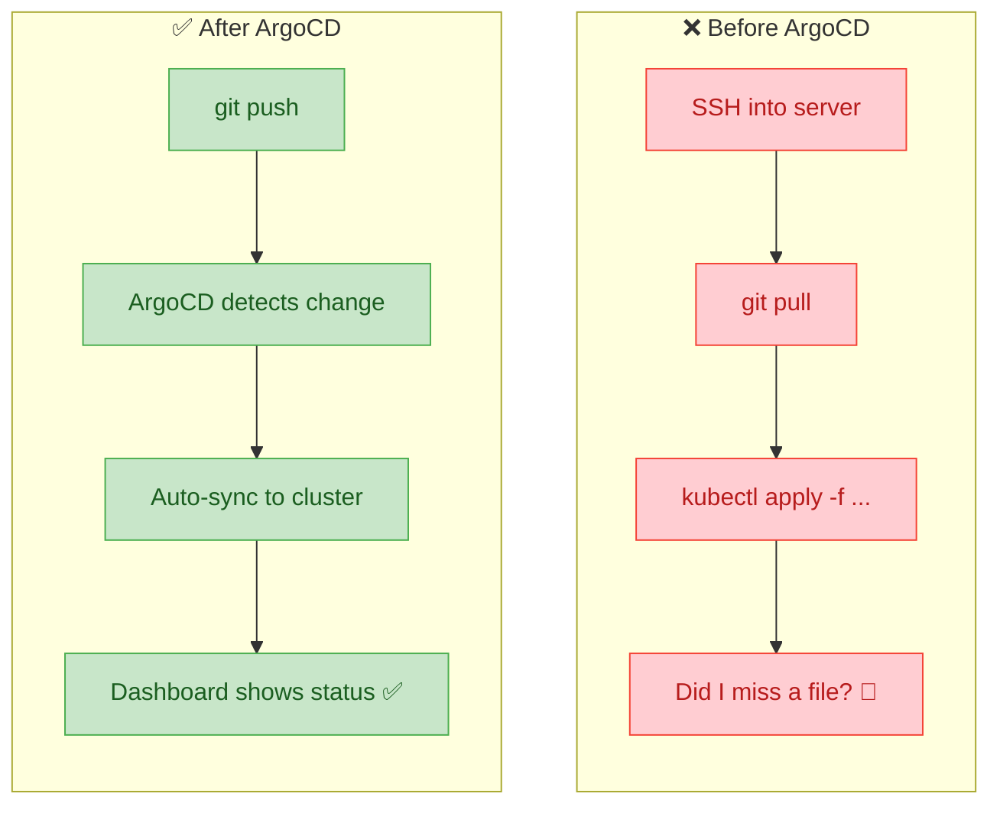

ArgoCD gives you:

| Benefit | What it means |
|---------|---------------|
| **Automatic deployment** | Push to Git → cluster updates itself |
| **Drift detection** | ArgoCD tells you if someone changed something by hand |
| **Self-healing** | If someone deletes a Pod manually, ArgoCD recreates it |
| **Rollback** | One click to go back to any previous version |
| **Visual dashboard** | See all your apps, their health, and sync status |
| **Audit trail** | Every change is a Git commit — who, what, when |

---

## 3. How ArgoCD works — the big picture

ArgoCD continuously compares two things:

1. **Desired state** — the YAML manifests in your Git repo
2. **Live state** — what is actually running in the cluster

If they match → everything is green (**Synced**).
If they differ → ArgoCD flags it (**OutOfSync**) and can auto-fix it.

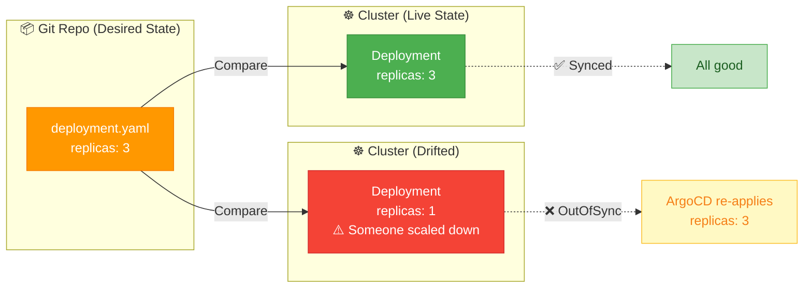

---

## 4. Architecture — what runs inside the cluster

ArgoCD installs several components in the `argocd` namespace:

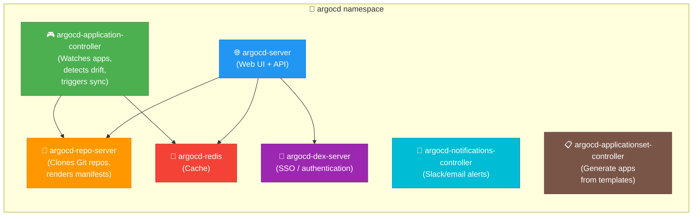

| Component | Role |
|-----------|------|
| **argocd-server** | The Web UI and API. You interact with this. |
| **argocd-repo-server** | Clones your Git repo and renders the manifests. |
| **argocd-application-controller** | The brain — watches applications, detects drift, triggers sync. |
| **argocd-redis** | In-memory cache for performance. |
| **argocd-dex-server** | Handles SSO and authentication (GitHub, Google, etc.). |
| **argocd-notifications-controller** | Sends alerts when things change (Slack, email, webhook). |
| **argocd-applicationset-controller** | Generates multiple Application resources from templates. |

---

## 5. Installation — what we did

Here is exactly what was done to install ArgoCD on this cluster:

```bash
# 1. Create the namespace
kubectl create namespace argocd

# 2. Install ArgoCD from the official manifests
kubectl apply -n argocd -f https://raw.githubusercontent.com/argoproj/argo-cd/stable/manifests/install.yaml \
  --server-side --force-conflicts

# 3. Patch the server to run in insecure mode (Traefik handles TLS)
kubectl -n argocd patch deployment argocd-server \
  --type='json' \
  -p='[{"op":"add","path":"/spec/template/spec/containers/0/args/-","value":"--insecure"}]'

# 4. Install the ArgoCD CLI (arm64)
curl -sSL -o /tmp/argocd https://github.com/argoproj/argo-cd/releases/latest/download/argocd-linux-arm64
sudo install -m 555 /tmp/argocd /usr/local/bin/argocd

# 5. Apply the Ingress so Traefik routes argocd.bit-habit.com to the server
kubectl apply -f apps/argocd/ingress.yaml

# 6. Apply the Application resources so ArgoCD watches this repo
kubectl apply -f apps/argocd/application.yaml
```

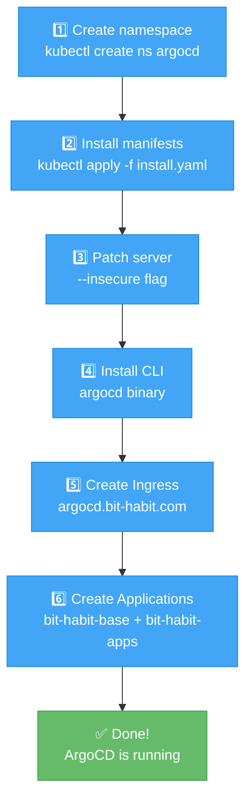

---

## 6. Accessing the ArgoCD UI

### 6.1 Login credentials

| Field | Value |
|-------|-------|
| **URL** | `https://argocd.bit-habit.com` |
| **Username** | `admin` |
| **Password** | Run: `kubectl -n argocd get secret argocd-initial-admin-secret -o jsonpath="{.data.password}" \| base64 -d` |

> **Tip:** Change the admin password after first login:
> ```bash
> argocd account update-password
> ```

### 6.2 Opening the dashboard

Once you log in, you will see the **Applications** page. Each card represents one Application resource — a set of Kubernetes manifests that ArgoCD is managing.

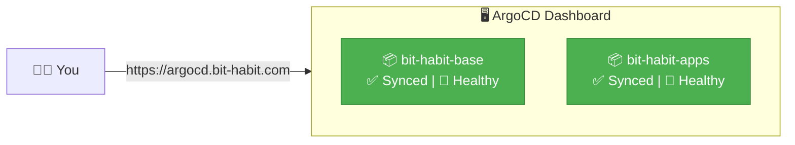

Click on any application card to see:
- **Resource tree** — every Pod, Service, Deployment managed by this app
- **Sync status** — is the cluster matching Git?
- **Health** — are all Pods running?
- **Diff** — what changed since last sync?
- **History** — every sync that ever happened

---

## 7. Core concepts

### 7.1 Application

An **Application** is the main resource in ArgoCD. It tells ArgoCD:
- **Where** to get manifests (Git repo URL + path + branch)
- **Where** to deploy them (which cluster + namespace)
- **How** to sync (automatic or manual)

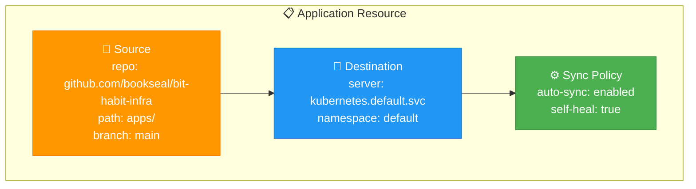

Our cluster has two Applications:

| Application | Watches | Contains |
|-------------|---------|----------|
| `bit-habit-base` | `base/` directory | Ingress, cert-manager, middlewares |
| `bit-habit-apps` | `apps/` directory | All app deployments and services |

### 7.2 Project

A **Project** groups Applications and controls what they can access. The `default` project allows everything. In a team environment, you would create separate projects to limit access.

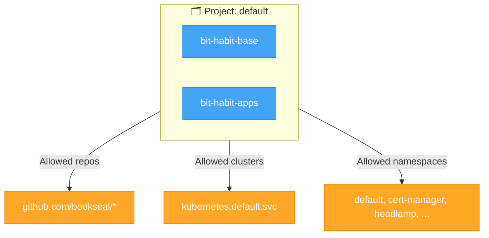

### 7.3 Sync and sync status

**Sync** means applying the Git manifests to the cluster.

| Status | Meaning | Color |
|--------|---------|-------|
| **Synced** | Cluster matches Git | 🟢 Green |
| **OutOfSync** | Cluster differs from Git | 🟡 Yellow |
| **Unknown** | ArgoCD cannot determine status | ⚪ Gray |

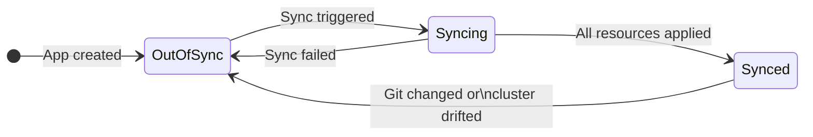

### 7.4 Health status

Health tells you if your applications are actually working (not just deployed).

| Status | Meaning | Color |
|--------|---------|-------|
| **Healthy** | All resources are running correctly | 💚 Green |
| **Progressing** | A rollout is in progress | 💙 Blue |
| **Degraded** | Something is failing | ❤️ Red |
| **Suspended** | Intentionally paused | ⏸️ Gray |
| **Missing** | Expected resource does not exist | ❓ Yellow |

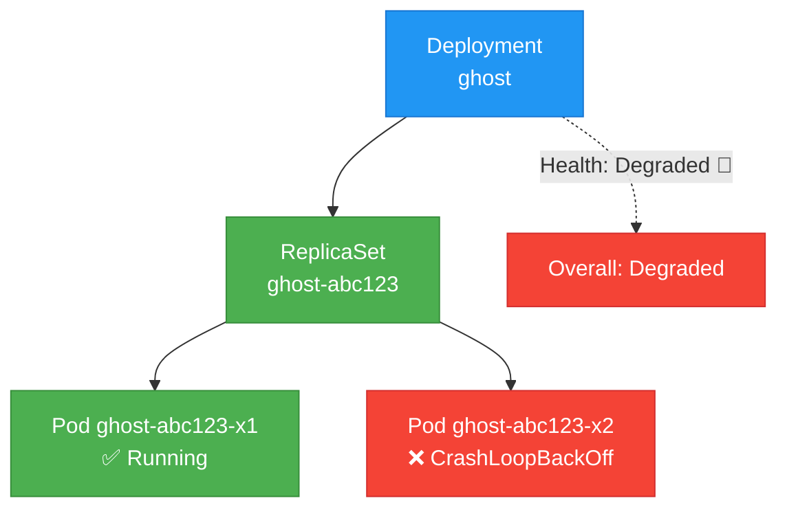

---

## 8. How our repo is connected

ArgoCD watches the `main` branch of this repository. Here is how the repo structure maps to ArgoCD Applications:

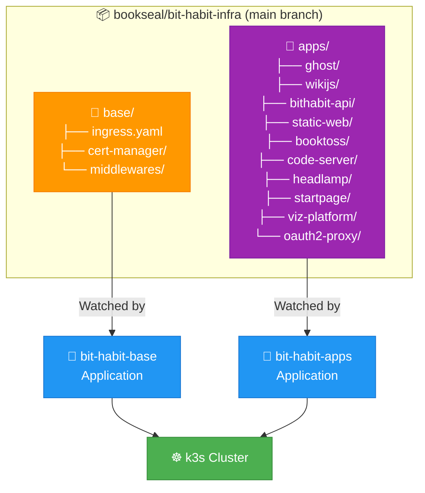

---

## 9. Daily operations — how to use ArgoCD

### 9.1 Deploying a change

This is the new workflow. No more SSH + kubectl.

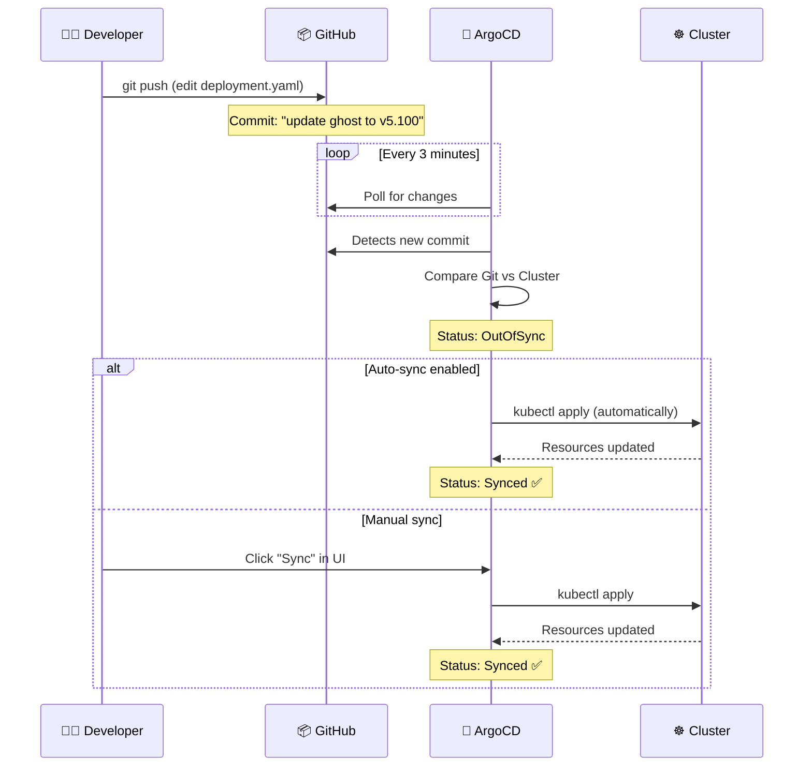

**Steps:**

1. Edit any YAML file in this repo (e.g., change the image tag in `apps/ghost/deployment.yaml`)
2. Commit and push to `main`
3. Wait ~3 minutes (ArgoCD polls every 3 minutes by default)
4. Check the ArgoCD dashboard — the app will show **OutOfSync** briefly, then **Synced**

> **Want instant sync?** After pushing, run:
> ```bash
> argocd app sync bit-habit-apps
> ```

### 9.2 Checking application status

**In the Web UI:**
- Go to `https://argocd.bit-habit.com`
- Each app card shows sync status and health at a glance

**From the CLI:**
```bash
# Overview of all apps
argocd app list

# Detailed status of one app
argocd app get bit-habit-apps
```

### 9.3 Manual sync

Sometimes you want to sync immediately without waiting for the poll interval.

**Web UI:** Click the app → click **SYNC** button → click **SYNCHRONIZE**.

**CLI:**
```bash
argocd app sync bit-habit-apps
```


### 9.4 Rolling back a deployment

Made a mistake? ArgoCD keeps a history of every sync.

**Web UI:** Click the app → **HISTORY AND ROLLBACK** → select the version you want → **Rollback**.

**CLI:**
```bash
# See sync history
argocd app history bit-habit-apps

# Rollback to a specific revision
argocd app rollback bit-habit-apps <HISTORY_ID>
```

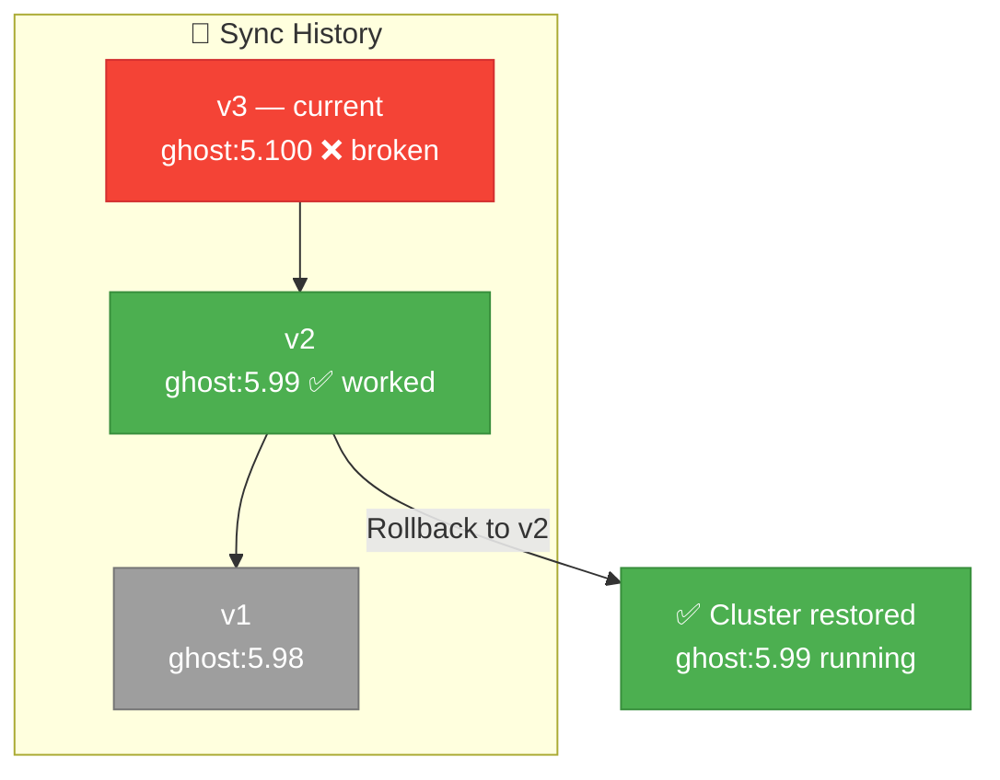

> **Important:** After a rollback, ArgoCD will show **OutOfSync** because the cluster no longer matches Git. You should also revert the bad commit in Git to keep them aligned.

### 9.5 Force refresh

ArgoCD caches the Git repo state. If you just pushed and want ArgoCD to check immediately:

**Web UI:** Click **REFRESH** (top-right of the app page).

**CLI:**
```bash
argocd app get bit-habit-apps --refresh
```

---

## 10. Using the ArgoCD CLI

### 10.1 Login

```bash
# Login via the Kubernetes API (no need for port-forward)
argocd login argocd.bit-habit.com --grpc-web

# Or, from the server directly
argocd login localhost:8080 --insecure --username admin --password $(kubectl -n argocd get secret argocd-initial-admin-secret -o jsonpath="{.data.password}" | base64 -d)
```

### 10.2 List applications

```bash
argocd app list
```

Output:
```
NAME             CLUSTER                         NAMESPACE  STATUS   HEALTH   SYNCPOLICY
bit-habit-base   https://kubernetes.default.svc  default    Synced   Healthy  Auto(Self-Heal)
bit-habit-apps   https://kubernetes.default.svc  default    Synced   Healthy  Auto(Self-Heal)
```

### 10.3 Sync an application

```bash
# Sync one app
argocd app sync bit-habit-apps

# Sync all apps
argocd app sync --all
```

### 10.4 View application details

```bash
argocd app get bit-habit-apps
```

This shows:
- Every resource managed by the app
- Sync status of each resource
- Health of each resource
- Last sync time and result

### 10.5 View sync history

```bash
argocd app history bit-habit-apps
```

### 10.6 Rollback

```bash
# List history first
argocd app history bit-habit-apps

# Rollback to ID 2
argocd app rollback bit-habit-apps 2
```

---

## 11. The sync process — step by step

When ArgoCD syncs, here is exactly what happens:

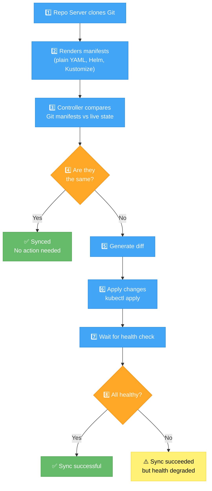

| Phase | What happens |
|-------|-------------|
| **PreSync** | Run any pre-sync hooks (e.g., database migration Jobs) |
| **Sync** | Apply all manifests with `kubectl apply` |
| **PostSync** | Run any post-sync hooks (e.g., notification Jobs) |
| **SyncFail** | Run hooks designated for failure handling |

---

## 12. Self-heal and auto-prune

### Self-heal

When `selfHeal: true` is set (as in our config), ArgoCD automatically reverts manual changes.

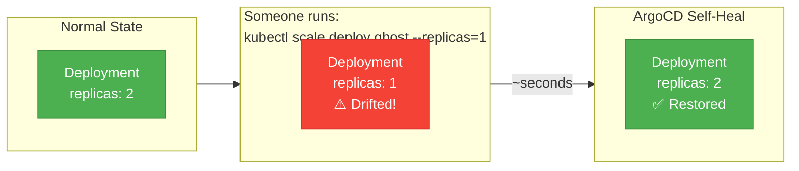

**This means:** No one can break things by running random `kubectl` commands. Git is always the source of truth.

### Auto-prune

When `prune: true` is set, ArgoCD **deletes** resources that were removed from Git. We have `prune: false` as a safety measure — if you accidentally delete a YAML file from the repo, ArgoCD will NOT delete the running resource.

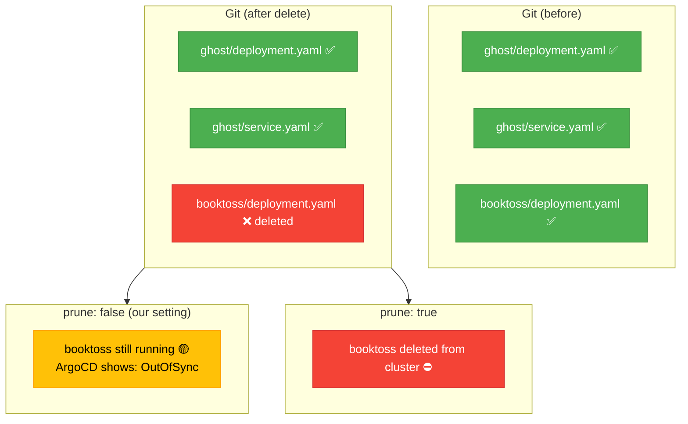

---

## 13. Troubleshooting common issues

### Application stuck on "OutOfSync"

```bash
# Check what is different
argocd app diff bit-habit-apps

# Force a sync
argocd app sync bit-habit-apps --force
```

### Pod is in CrashLoopBackOff

ArgoCD will show the app as **Degraded**. This is a Kubernetes issue, not an ArgoCD issue.

```bash
# Check pod logs
kubectl logs <pod-name> -n <namespace>

# Check events
kubectl describe pod <pod-name> -n <namespace>
```

### ArgoCD cannot access the Git repo

```bash
# Check repo connection
argocd repo list

# Test connectivity
argocd repo add https://github.com/bookseal/bit-habit-infra.git --username <user> --password <token>
```

### Sync fails with "resource already exists"

This happens when a resource was created outside of ArgoCD. Fix:

```bash
# Tell ArgoCD to adopt the existing resource
kubectl annotate <resource-type> <resource-name> argocd.argoproj.io/managed-by=bit-habit-apps
```

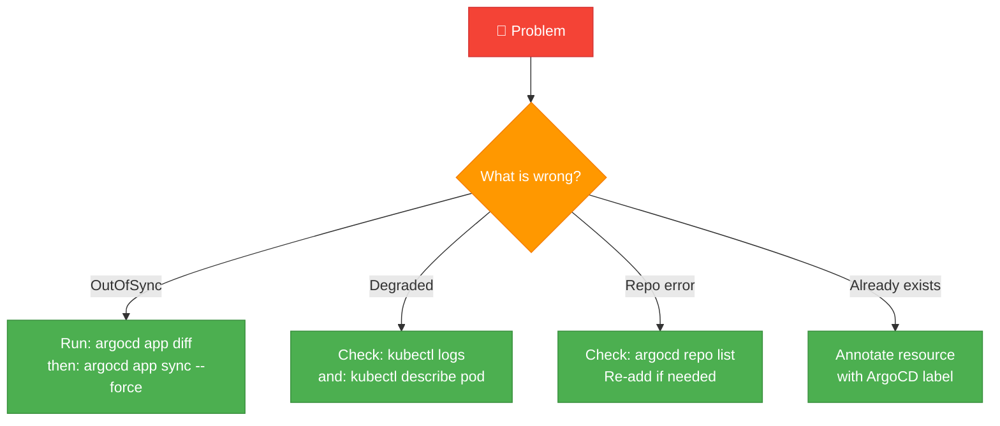

---

## 14. Security best practices

1. **Change the admin password** after first login
   ```bash
   argocd account update-password
   ```

2. **Delete the initial admin secret** once the password is changed
   ```bash
   kubectl -n argocd delete secret argocd-initial-admin-secret
   ```

3. **Use HTTPS** for Git repo access (not SSH) when possible — easier to manage

4. **Use RBAC** to limit who can sync or delete applications
   ```yaml
   # In argocd-rbac-cm ConfigMap
   policy.csv: |
     p, role:readonly, applications, get, */*, allow
     p, role:readonly, applications, sync, */*, deny
   ```

5. **Set up SSO** instead of the built-in admin account (ArgoCD supports GitHub, Google, OIDC)

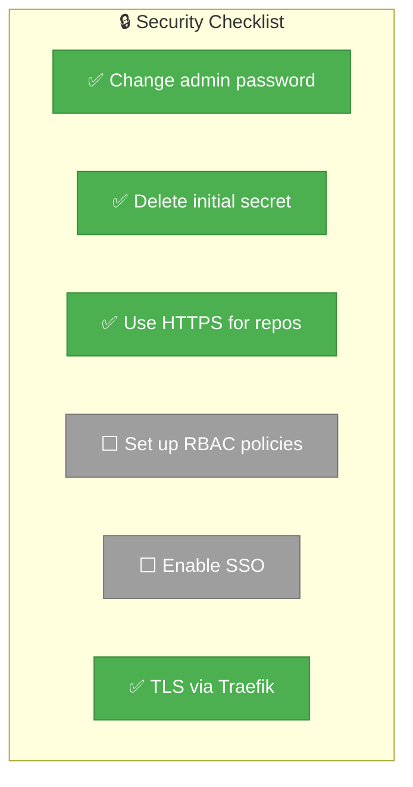

---

## 15. Quick reference cheat sheet

| Task | Command |
|------|---------|
| Login | `argocd login argocd.bit-habit.com --grpc-web` |
| List apps | `argocd app list` |
| Sync app | `argocd app sync bit-habit-apps` |
| Sync all | `argocd app sync --all` |
| App details | `argocd app get bit-habit-apps` |
| App diff | `argocd app diff bit-habit-apps` |
| Sync history | `argocd app history bit-habit-apps` |
| Rollback | `argocd app rollback bit-habit-apps <ID>` |
| Force refresh | `argocd app get bit-habit-apps --refresh` |
| Hard refresh | `argocd app get bit-habit-apps --hard-refresh` |
| Delete app | `argocd app delete bit-habit-apps` |
| List repos | `argocd repo list` |
| Get password | `kubectl -n argocd get secret argocd-initial-admin-secret -o jsonpath="{.data.password}" \| base64 -d` |
| ArgoCD pods | `kubectl get pods -n argocd` |
| ArgoCD logs | `kubectl logs -n argocd deployment/argocd-server` |

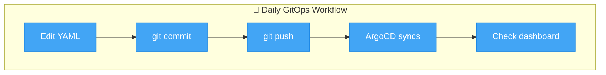

---

> **Next steps:** Once you are comfortable with ArgoCD basics, explore:
> - **ApplicationSets** — generate applications from templates (e.g., one per directory in `apps/`)
> - **Notifications** — get Slack/email alerts when syncs happen
> - **Image Updater** — automatically update image tags when new versions are pushed to a registry
> - **SSO with GitHub** — use your GitHub account instead of the admin password
